---
## Author
author:
  name: Юсупова Амина Руслановна
  affiliation:
    - name: Российский университет дружбы народов
      country: Российская Федерация
      postal-code: 117198
      city: Москва
      address: ул. Миклухо-Маклая, д. 6
lang: ru
format:
  pdf:
    documentclass: scrartcl
    latex-engine: xelatex
    mainfont: "Liberation Serif"
    sansfont: "Liberation Sans"
    monofont: "Liberation Mono"
    include-in-header:
      text: |
        \usepackage{fontspec}
        \setmainfont{Liberation Serif}
        \setsansfont{Liberation Sans}
        \setmonofont{Liberation Mono}
  pptx:
    toc: false
## Title
title: Отчёт по 1 разделу внешнего курса
subtitle: Введение
license: CC BY

---

# Цели работы

## Цель работы

Приобретение базовые практические навыки работы в консольной среде операционной системы Linux.

# Выполнение работы

## 1 Раздел

### 1.1

В этом разделе заданы общие вопросы насчёт курса

### 1.2

**Вопрос 1:**

{ #fig:001 width=70% height=70% }

**Вопрос 2:** 

{ #fig:002 width=70% height=70% }

**Вопрос 3:** 
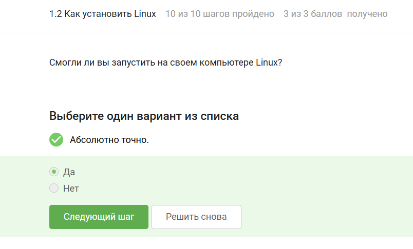{ #fig:003 width=70% height=70% }

### 1.3

**Вопрос 1:** 

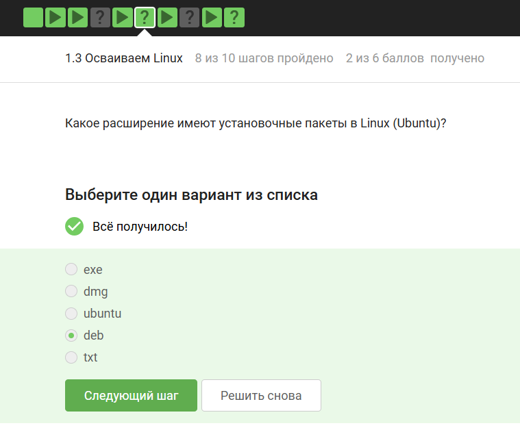{ #fig:004 width=70% height=70% }

**Вопрос 2:** 

{ #fig:005 width=70% height=70% }

 
### 1.4

**Вопрос 1:** 

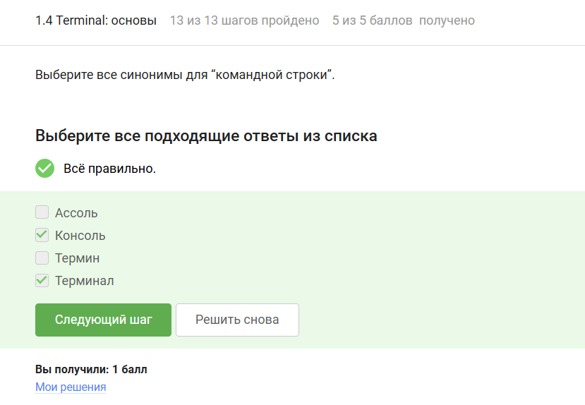{ #fig:006 width=70% height=70% }

**Вопрос 2:** 

{ #fig:007 width=70% height=70% }

**Вопрос 3:** 

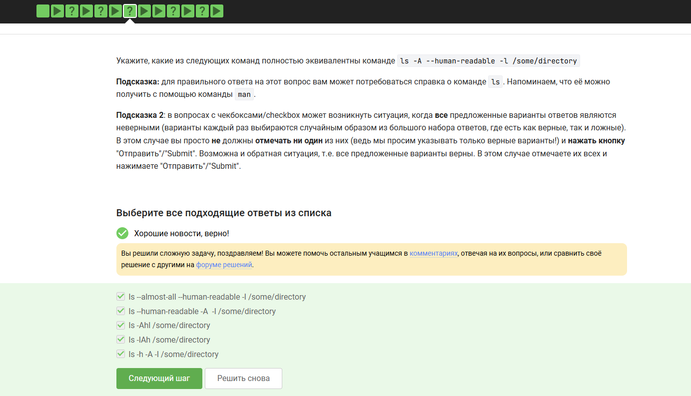{ #fig:007 width=70% height=70% }

**Вопрос 4:**

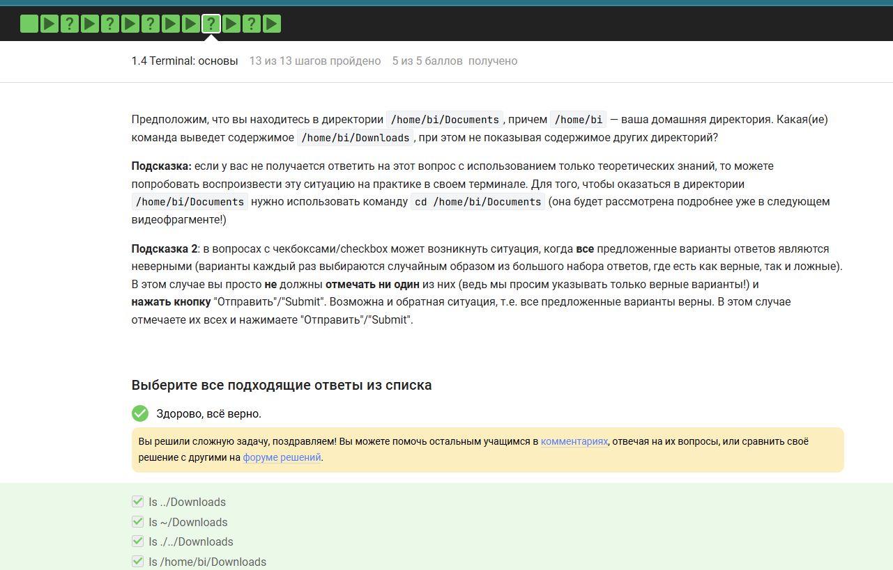{ #fig:007 width=70% height=70% }

**Вопрос 5:**

{ #fig:010 width=70% height=70% }

### 1.5

**Вопрос 1:** 
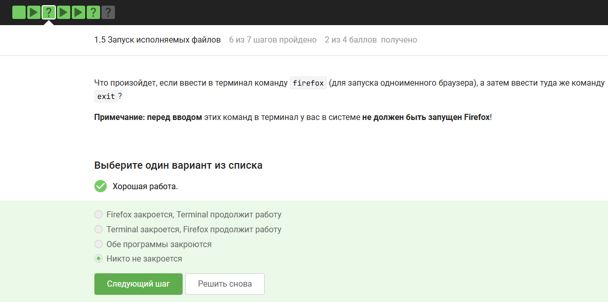{ #fig:011 width=70% height=70% }

**Вопрос 2:** 

{ #fig:012 width=70% height=70% }

### 1.6

**Вопрос 1:**

{ #fig:013 width=70% height=70% }

**Вопрос 2:** 

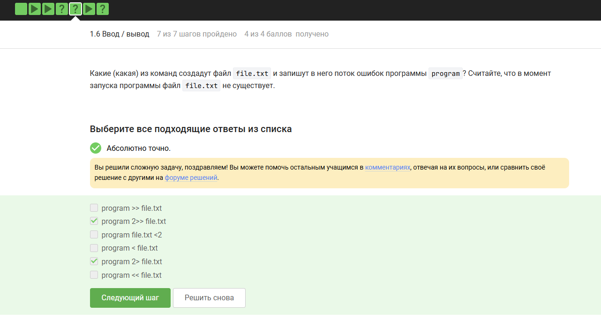{ #fig:014 width=70% height=70% }

**Вопрос 3:** 

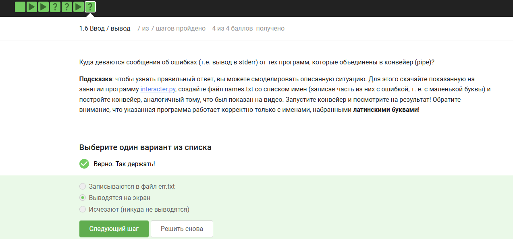{ #fig:015 width=70% height=70% }

### 1.7
 
**Вопрос 1:** 
{ #fig:016 width=70% height=70% }

**Вопрос 2:** 
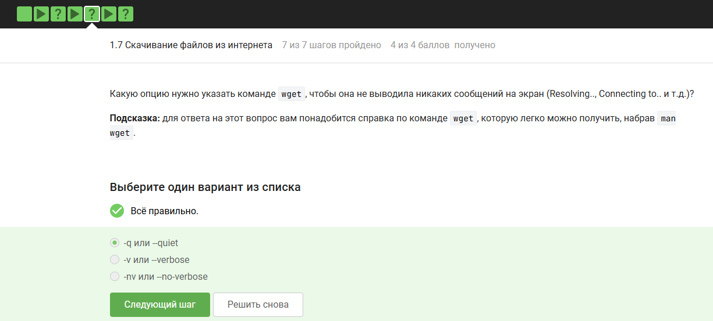{ #fig:017 width=70% height=70% }

**Вопрос 3:**
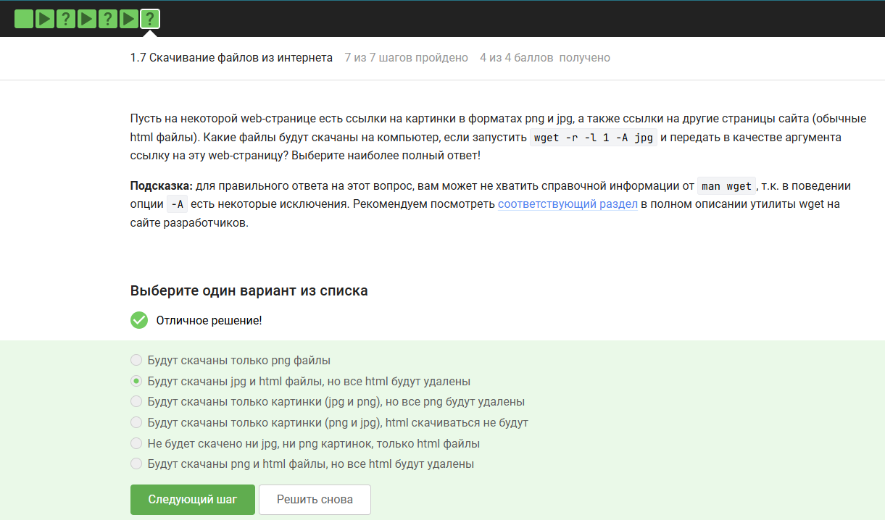{ #fig:018 width=70% height=70% }

### 1.8

**Вопрос 1:** 
{ #fig:019 width=70% height=70% }

**Вопрос 2:** 
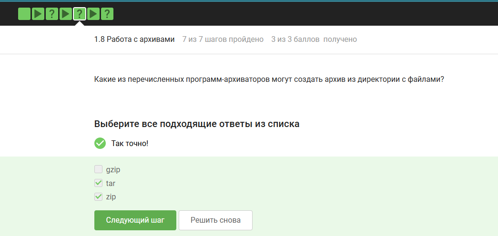{ #fig:020 width=70% height=70% }

**Вопрос 21:** 
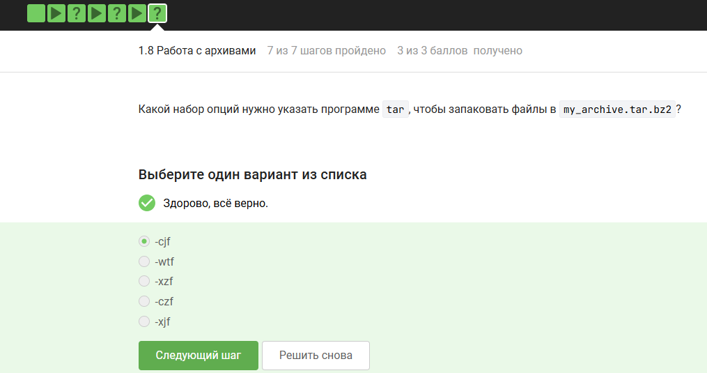{ #fig:021 width=70% height=70% }

### 1.9

**Вопрос 1:** 
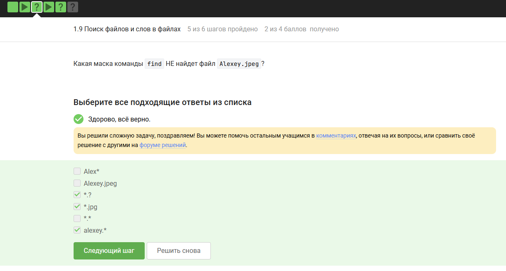{ #fig:022 width=70% height=70% }

**Вопрос 2:** 
{ #fig:023 width=70% height=70% }

# Заключение по проделанной работе
## Заключение 
Выполнены все тестовые задания по 1 разделу