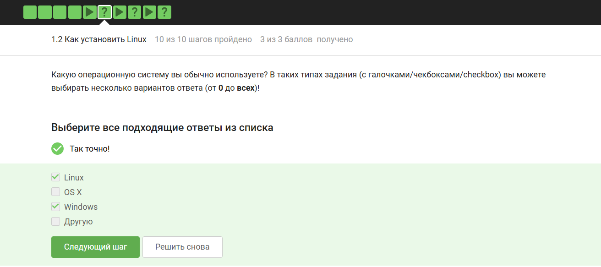
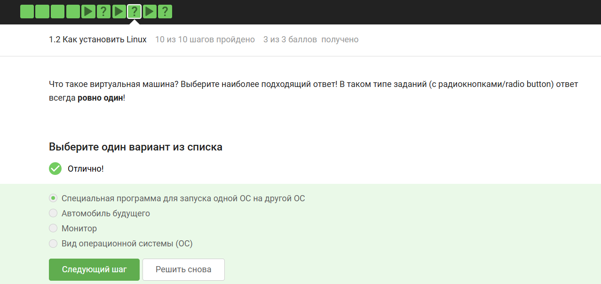
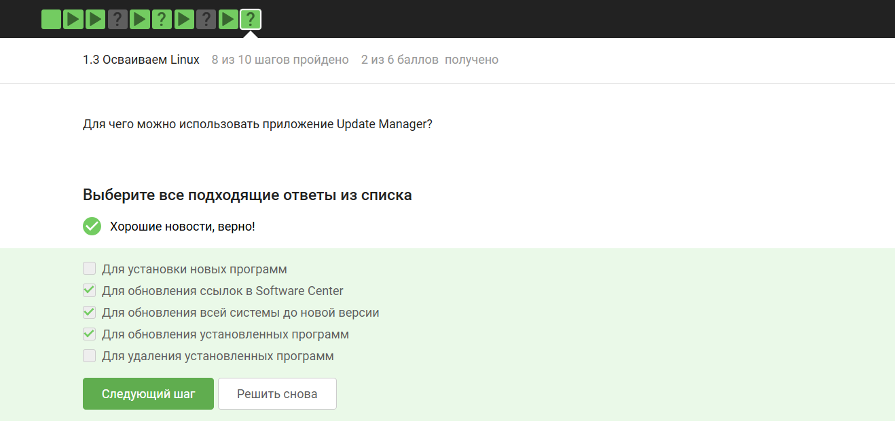
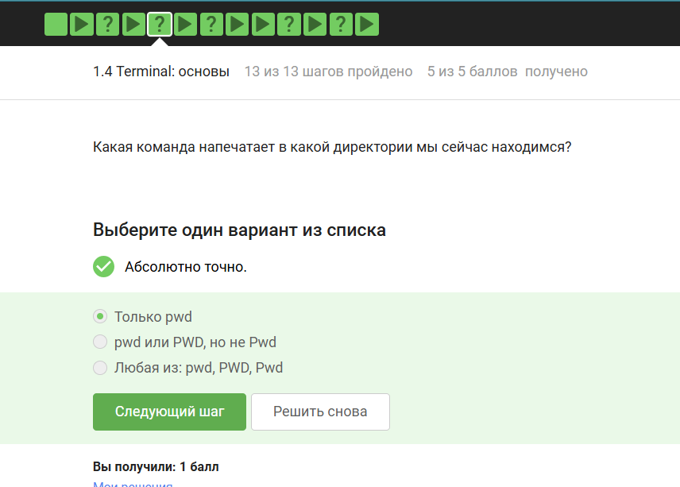
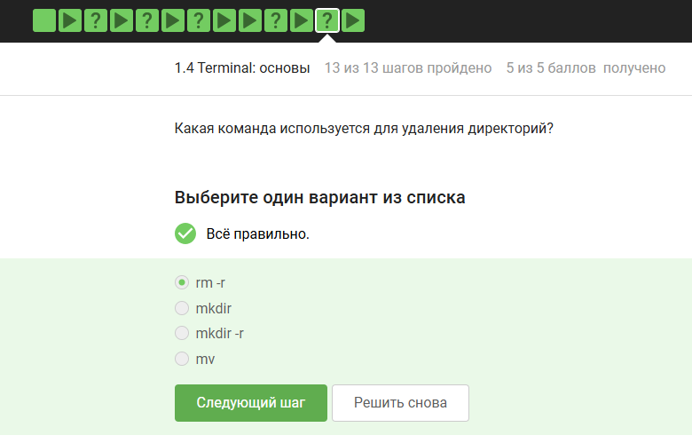
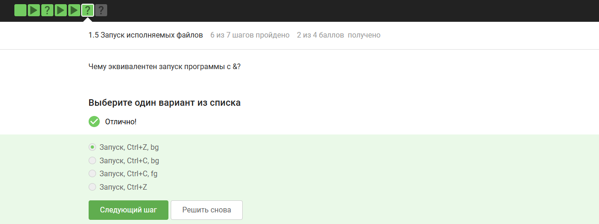
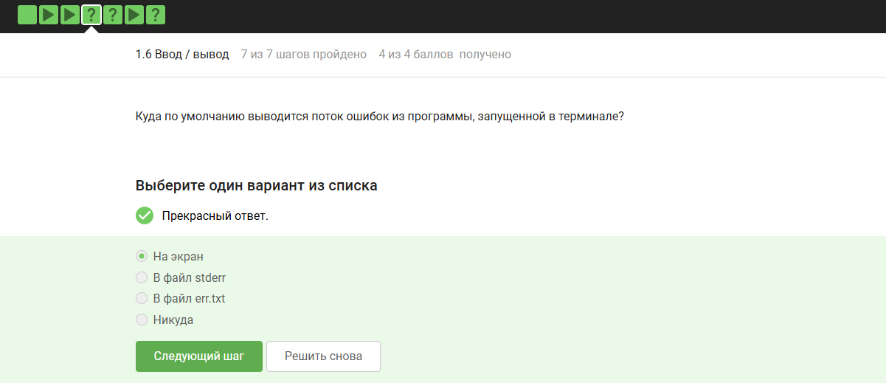
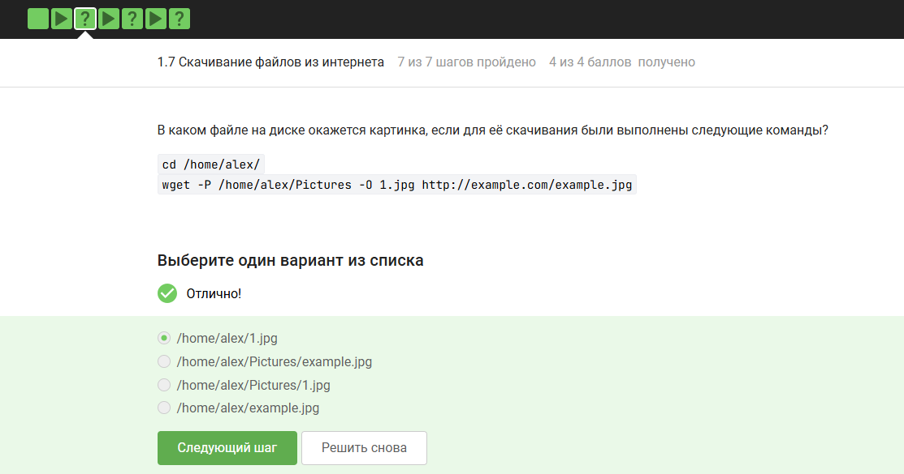
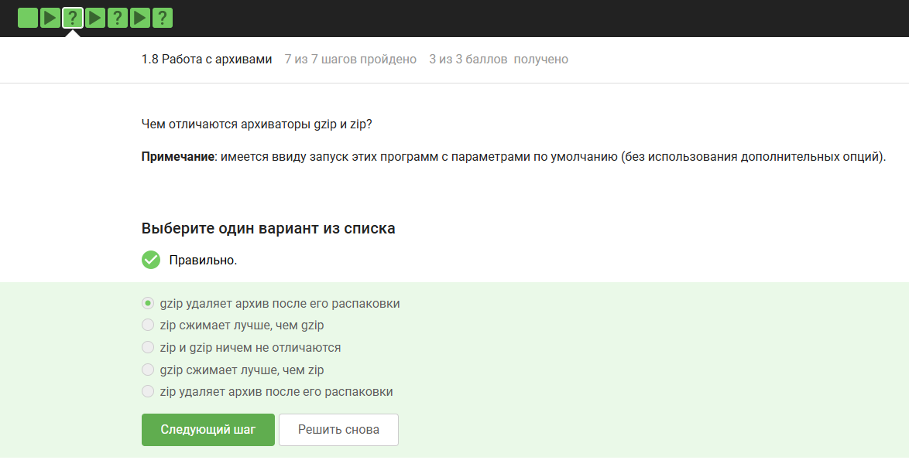
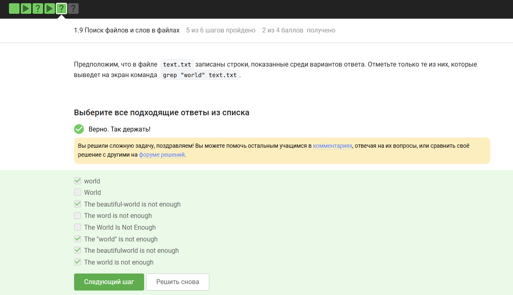

---
## Front matter
title: "Отчёт по 1 разделу внешнего курса"
subtitle: "Введение"
author: "Юсупова Амина Руслановна"

## Generic otions
lang: ru-RU
toc-title: "Содержание"

## Bibliography
bibliography: bib/cite.bib
csl: _resources/csl/gost-r-7-0-5-2008-numeric.csl

## Pdf output format
toc: true # Table of contents
toc-depth: 2
lof: true # List of figures
lot: true # List of tables
fontsize: 12pt
linestretch: 1.5
papersize: a4
documentclass: scrreprt
## I18n polyglossia
polyglossia-lang:
  name: russian
  options:
  - spelling=modern
  - babelshorthands=true
polyglossia-otherlangs:
  name: english
## I18n babel
babel-lang: russian
babel-otherlangs: english
## Fonts
mainfont: IBM Plex Serif
romanfont: IBM Plex Serif
sansfont: IBM Plex Sans
monofont: IBM Plex Mono
mathfont: STIX Two Math
mainfontoptions: Ligatures=Common,Ligatures=TeX,Scale=0.94
romanfontoptions: Ligatures=Common,Ligatures=TeX,Scale=0.94
sansfontoptions: Ligatures=Common,Ligatures=TeX,Scale=MatchLowercase,Scale=0.94
monofontoptions: Scale=MatchLowercase,Scale=0.94,FakeStretch=0.9
mathfontoptions: ''

biblatex: true
biblio-style: "gost-numeric"
biblatexoptions:
  - parentracker=true
  - backend=biber
  - hyperref=auto
  - language=auto
  - autolang=other*
  - citestyle=gost-numeric
## Pandoc-crossref LaTeX customization
figureTitle: "Рис."
tableTitle: "Таблица"
listingTitle: "Листинг"
lofTitle: "Список иллюстраций"
lotTitle: "Список таблиц"
lolTitle: "Листинги"
## Misc options
indent: true
header-includes:
  - \usepackage{indentfirst}
  - \usepackage{float} # keep figures where there are in the text
  - \floatplacement{figure}{H} # keep figures where there are in the text
---

# Цель работы

Приобретение базовые практические навыки работы в консольной среде операционной системы Linux.

# Выполнение заданий 

## 1 Раздел

### 1.1

В этом разделе заданы общие вопросы насчёт курса

### 1.2

**Вопрос 1:** *Какую операционную систему вы обычно используете?*  
**Правильных ответов нет — это опрос.**  
На скриншоте ни один вариант не отмечен. Задание чисто анкетное, баллы не влияют на результат.

{ #fig:001 width=70% height=70% }

**Вопрос 2:** *Что такое виртуальная машина?*  
**Правильный ответ (отмечен ✔):**  
> Специальная программа для запуска одной ОС на другой ОС.

Остальные варианты — шуточные или неверные.

{ #fig:002 width=70% height=70% }

**Вопрос 3:** *Смогли ли вы запустить на своем компьютере Linux?*  
**Отмечен ответ:** «Абсолютно точно».  
Это самооценка выполнения практической части.

{ #fig:003 width=70% height=70% }

### 1.3

**Вопрос 1:** *Какое расширение имеют установочные пакеты в Linux (Ubuntu)?*  
**Правильный ответ (●):** `deb`  
`.exe` – Windows, `.dmg` – macOS, `.txt` – текстовый файл.

{ #fig:004 width=70% height=70% }

**Вопрос 2:** *Для чего можно использовать приложение Update Manager?*  
**Отмечены верные:**  
- Для обновления ссылок в Software Center  
- Для обновления всей системы до новой версии  
- Для обновления установленных программ  

Не отмечены (неверные):  
- Для установки новых программ  
- Для удаления установленных программ  

{ #fig:005 width=70% height=70% }

 
### 1.4

**Вопрос 1:** *Выберите все синонимы для “командной строки”.*  
**Правильные (отмечены):**  
- Консоль  
- Терминал  

«Ассоль» и «Термин» – неверно.

{ #fig:006 width=70% height=70% }

**Вопрос 2:** *Какая команда напечатает, в какой директории мы сейчас находимся?*  
**Правильный ответ:**  
> Только `pwd`.  

Вариант `pwd` или `PWD` – неверен, так как команда чувствительна к регистру.

{ #fig:007 width=70% height=70% }

**Вопрос 3:** *Укажите, какие команды эквивалентны `ls -A --human-readable -l /some/directory`*  
**Отмечены все верные (на скриншоте – зелёная галочка «Хорошие новости» за сложную задачу).**  
Из предложенных эквивалентны:  
- `ls –human-readable -A -l /some/directory`  
- `ls -Ahl /some/directory`  
- `ls -h -A -l /some/directory`  

Неверные:  
- `ls –almost-all –human-readable -l` (дефисы другого типа)  
- `ls -IAh` (ключ `-I` – исключение шаблона)

{ #fig:007 width=70% height=70% }

**Вопрос 4:** *Какая команда выведет содержимое `/home/bi/Downloads` из `/home/bi/Documents`?*  
**Правильные (отмечены):**  
- `ls ../Downloads`  
- `ls ~/Downloads`  
- `ls /home/bi/Downloads`  

`ls ../Downloads` повторён дважды в списке – возможно, технический дубль.

{ #fig:007 width=70% height=70% }

**Вопрос 5:** *Какая команда используется для удаления директорий?*  
**Правильный ответ:** `rm -r`  
`mkdir` – создание, `mv` – перемещение.

{ #fig:010 width=70% height=70% }

### 1.5

**Вопрос 1:** *Что произойдет, если ввести в терминал команду firefox (для запуска одноименного браузера), а затем ввести туда же команду exit?*

**Правильный ответ (отмечен ✔):** Terminal закроется, Firefox продолжит работу.

**Почему это правильный ответ?**
1. Команда firefox запускает браузер в фоновом режиме (или как дочерний процесс терминала, но сразу отделяясь).

2. Терминал ждёт завершения программы, но Firefox продолжает работать независимо.

3. Команда exit закрывает текущую сессию терминала (оболочку, shell).

4. Если терминал был основным окном, он закроется.
Firefox при этом не завершается, потому что он не привязан к жизни терминала — он продолжает работать в системе как отдельный процесс.

{ #fig:011 width=70% height=70% }

**Вопрос 2:** *Чему эквивалентен запуск программы с `&` (в фоне)?*  
**Правильный ответ:** «Запуск, Ctrl+Z, bg»  
Схема: запуск → приостановка (Ctrl+Z) → фон (bg).

{ #fig:012 width=70% height=70% }

### 1.6

**Вопрос 1:** *Куда по умолчанию выводится поток ошибок (stderr)?*  
**Правильный ответ:** «На экран»  
Ошибки и обычный вывод идут в терминал, если их не перенаправить.

{ #fig:013 width=70% height=70% }

**Вопрос 2:** *Какие команды создадут `file.txt` и запишут в него stderr программы `program`?*  
**Верные:**  
- `program 2>> file.txt` (дозапись)  
- `program 2> file.txt` (перезапись)  

Остальные варианты неверны (перенаправляют stdout, ввод или используют неверный синтаксис).

{ #fig:014 width=70% height=70% }

**Вопрос 3:** *Куда деваются stderr от программ в конвейере (pipe)?*  
**Правильный ответ:** «Выводятся на экран»  
Pipe передаёт только stdout, stderr остаётся в терминале.

{ #fig:015 width=70% height=70% }

### 1.7
 
**Вопрос 1:** *Где окажется картинка после `cd /home/alex/` и `wget -P /home/alex/Pictures -O 1.jpg http://example.com/example.jpg`?*  
**Правильный ответ:** `/home/alex/Pictures/1.jpg`  
`-P` – каталог, `-O` – имя выходного файла.

{ #fig:016 width=70% height=70% }

**Вопрос 2:** *Какая опция `wget` подавляет сообщения?*  
**Правильный ответ:** `-q` или `--quiet`  

{ #fig:017 width=70% height=70% }

**Вопрос 3:** *Что скачает `wget -r -l 1 -A jpg`?*  
**Правильный ответ:**  
> Будут скачаны jpg и html файлы, но все html будут удалены.

Особенность `-A` при рекурсивной загрузке.

{ #fig:018 width=70% height=70% }

### 1.8

**Вопрос 1:** *Чем отличаются gzip и zip (по умолчанию)?*  
**Правильный ответ:**  
> gzip удаляет архив после его распаковки.  

Zip – сохраняет, gzip – распаковывает и удаляет `.gz`.

{ #fig:019 width=70% height=70% }

**Вопрос 2:** *Какие программы могут создать архив из директории?*  
**Правильные (отмечены):**  
- `tar`  
- `zip`  

`gzip` без `tar` работает только с одним файлом.

{ #fig:020 width=70% height=70% }

**Вопрос 21:** *Какой набор опций tar для создания `.tar.bz2`?*  
**Правильный ответ:** `-cjf`  
`c` – create, `j` – bzip2, `f` – файл.

{ #fig:021 width=70% height=70% }

### 1.9

**Вопрос 1:** *Какая маска `find` НЕ найдет `Alexey.jpeg`?*  
**Верные (НЕ найдут):**  
- `*.?` (ждёт 1 символ после точки)  
- `*.jpg` (другое расширение)  
- `alexey.*` (регистр – должно быть `Alexey`)

Остальные маски найдут.

{ #fig:022 width=70% height=70% }

**Вопрос 2:** *Какие строки выведет `grep "world" text.txt`?*  
**Правильные (отмечены):**  
- `The beautiful-world is not enough`  
- `The "world" is not enough`  
- `The world is not enough`  

`grep` ищет точное вхождение слова `world` (регистр важен, без кавычек внутри строки). «World» с большой буквы не подходит.

{ #fig:023 width=70% height=70% }

# Заключение 
Выполнены все задания по 1 разделу