---
## Author
author:
  name: Юсупова Амина Руслановна
  affiliation:
    - name: Российский университет дружбы народов
      country: Российская Федерация
      postal-code: 117198
      city: Москва
      address: ул. Миклухо-Маклая, д. 6
lang: ru
format:
  pdf:
    documentclass: scrartcl
    latex-engine: xelatex
    mainfont: "Liberation Serif"
    sansfont: "Liberation Sans"
    monofont: "Liberation Mono"
    include-in-header:
      text: |
        \usepackage{fontspec}
        \setmainfont{Liberation Serif}
        \setsansfont{Liberation Sans}
        \setmonofont{Liberation Mono}
  pptx:
    toc: false
## Title
title: Отчёт по 2 разделу внешнего курса
subtitle: Работа на сервере
license: CC BY

---

# Цели работы

## Цель работы

Продолжение освоения базовых практических навыков работы в консольной среде операционной системы Linux. Освоение работы с удалённым сервером, обменом файлами, управлением процессами, многопоточными приложениями и менеджером терминалов tmux.

# Выполнение заданий 

## 2.1 Знакомство с сервером

### **Вопрос 1:** 

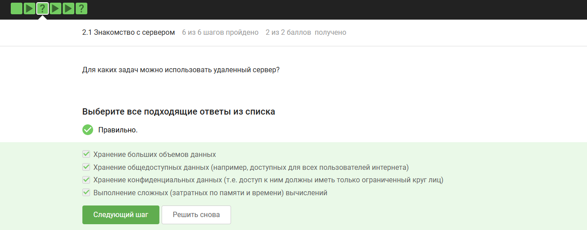{ #fig:001 width=70% height=70% }

### **Вопрос 2:**

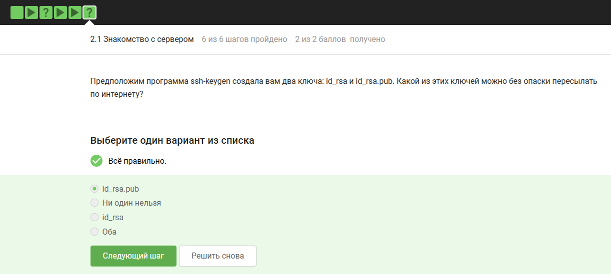{ #fig:002 width=70% height=70% }

## 2.2 Обмен файлами

### **Вопрос 1:** 
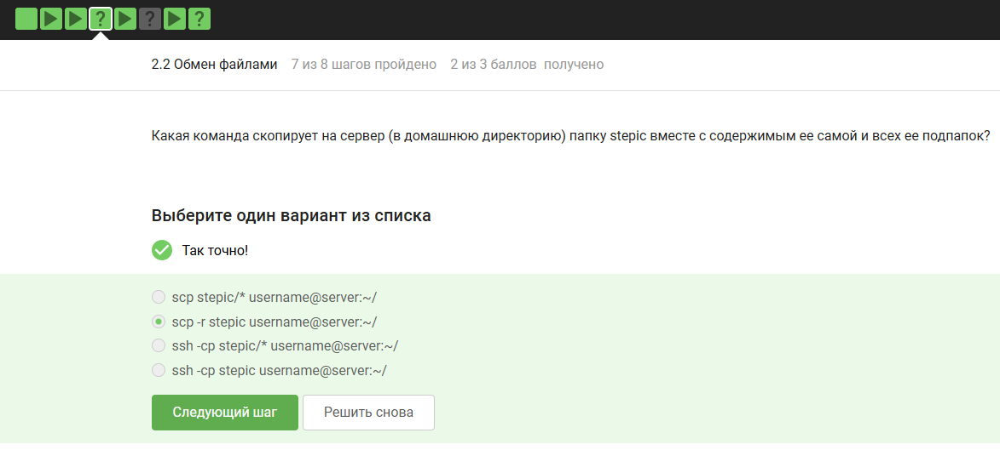{ #fig:003 width=70% height=70% }

### **Вопрос 2:** 
{ #fig:004 width=70% height=70% }

## 2.3 Запуск приложений

### **Вопрос 1:** 
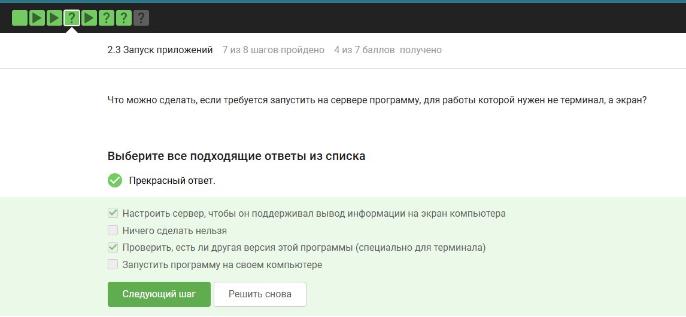{ #fig:005 width=70% height=70% }

### **Вопрос 2:** 
{ #fig:006 width=70% height=70% }

### **Вопрос 3 (FastQC):** 
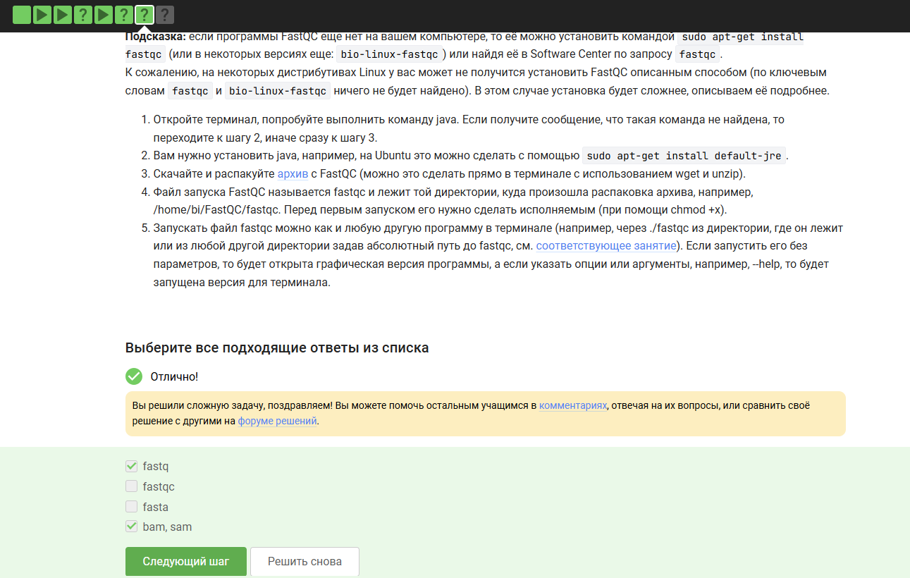{ #fig:007 width=70% height=70% }

## 2.4 Контроль запускаемых программ

### **Вопрос 1:** 
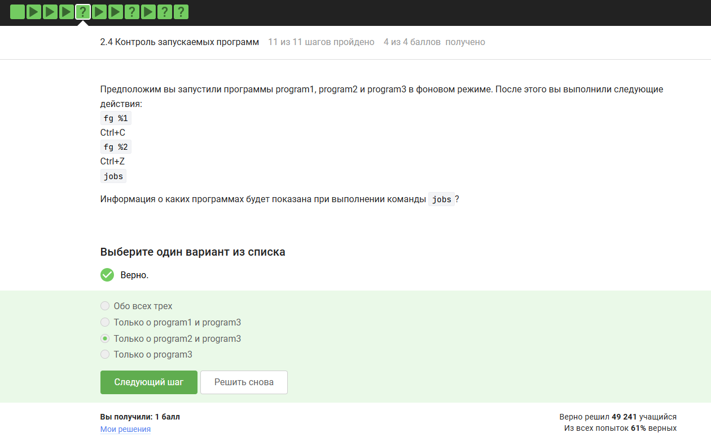{ #fig:008 width=70% height=70% }

### **Вопрос 2:** 
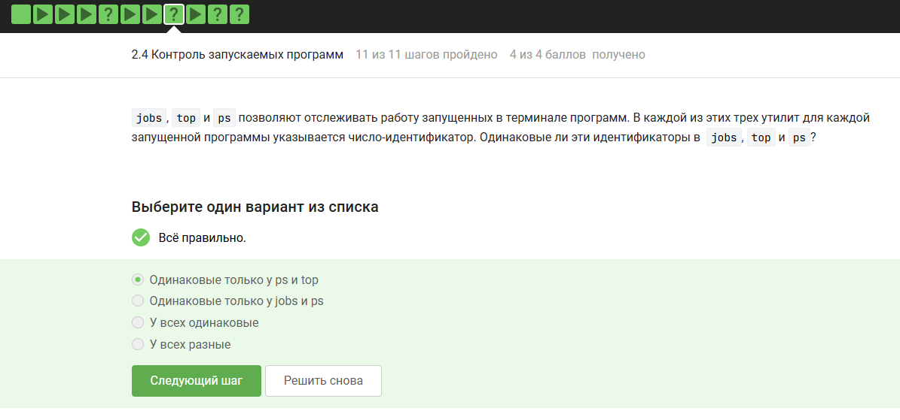{ #fig:009 width=70% height=70% }

### **Вопрос 3:** 
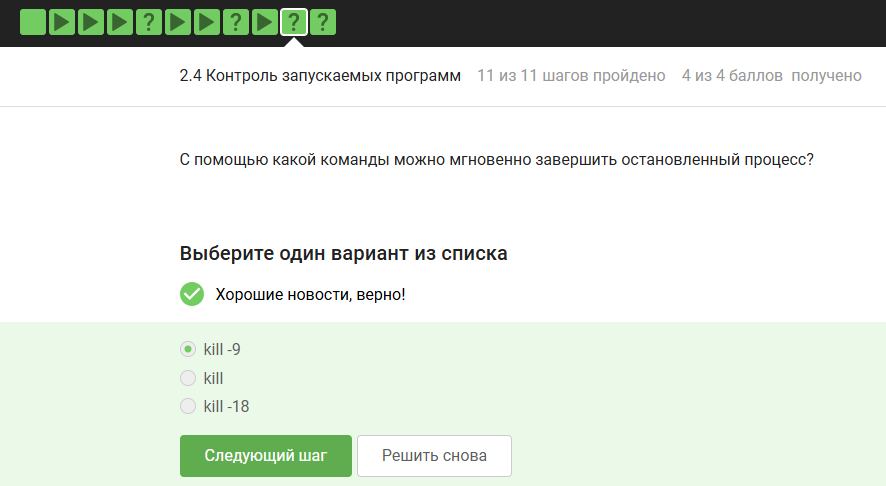{ #fig:010 width=70% height=70% }

### **Вопрос 4:** 
{ #fig:011 width=70% height=70% }

## 2.5 Многопоточные приложения

### **Вопрос 1:** 
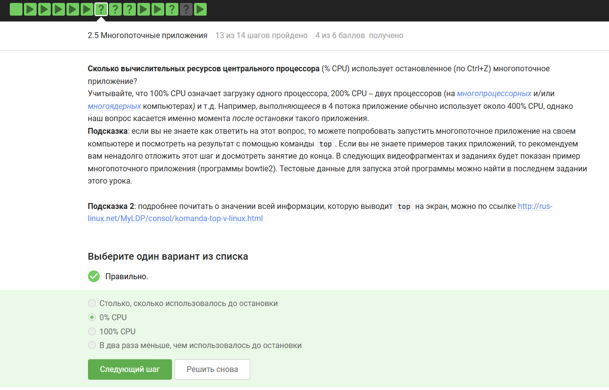{ #fig:012 width=70% height=70% }

### **Вопрос 2:** 
{ #fig:013 width=70% height=70% }

### **Вопрос 3:** 
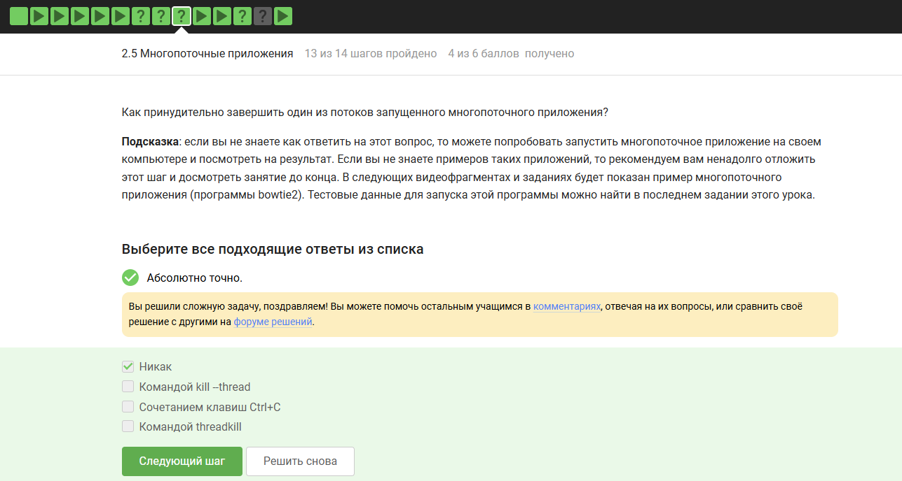{ #fig:014 width=70% height=70% }

### **Вопрос 4 (bowtie2):** 
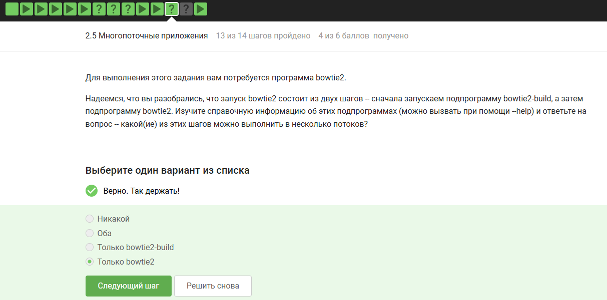{ #fig:015 width=70% height=70% }

## 2.6 Менеджер терминалов tmux

### **Вопрос 1:** 
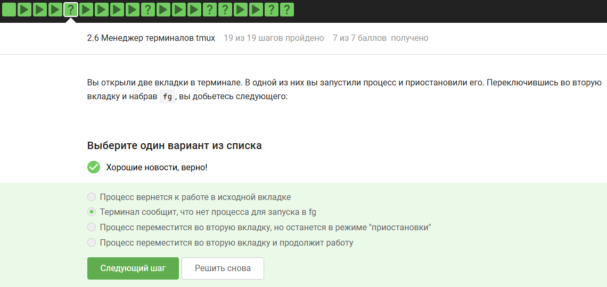{ #fig:016 width=70% height=70% }

### **Вопрос 2:** 
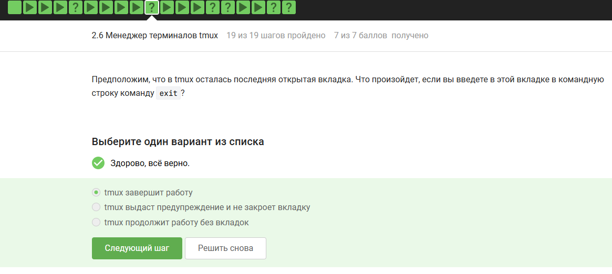{ #fig:017 width=70% height=70% }

### **Вопрос 3:** 
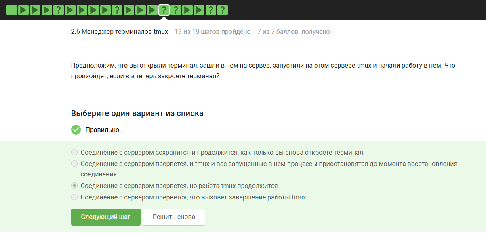{ #fig:018 width=70% height=70% }

### **Вопрос 4:** 
{ #fig:019 width=70% height=70% }

### **Вопрос 5:** 
{ #fig:020 width=70% height=70% }

### **Вопрос 6 (разделение вкладок — split):** 
{ #fig:021 width=70% height=70% }

# Заключение

Выполнены все задания по 2 разделу курса. Освоены:
- работа с удалёнными серверами и SSH-ключами;
- копирование файлов через SCP и Filezilla;
- управление процессами (jobs, kill, фоновый/передний план);
- особенности работы многопоточных приложений;
- использование менеджера терминалов tmux (вкладки, разделение экрана, сохранение сессий).
