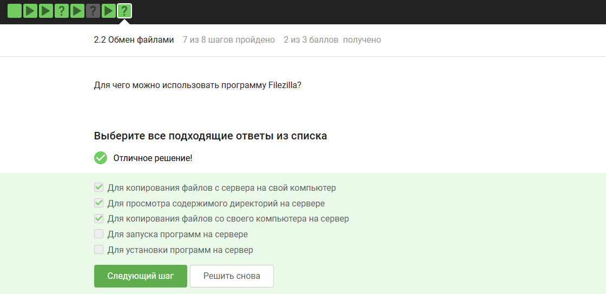
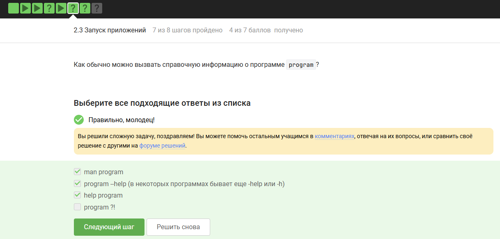
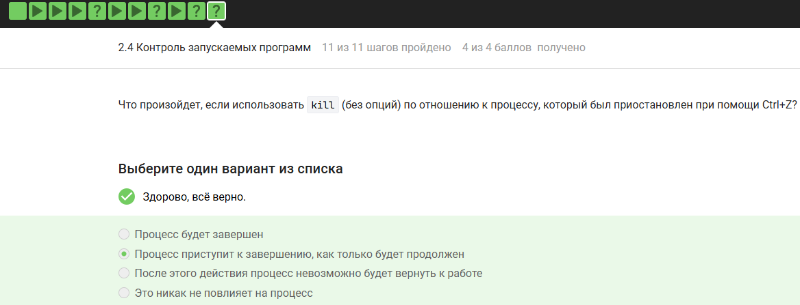
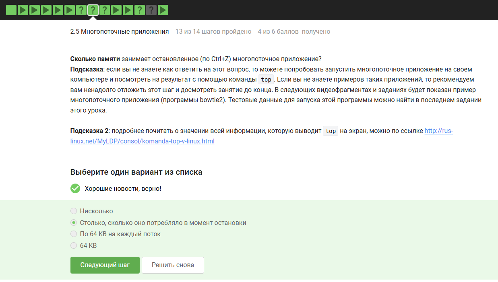
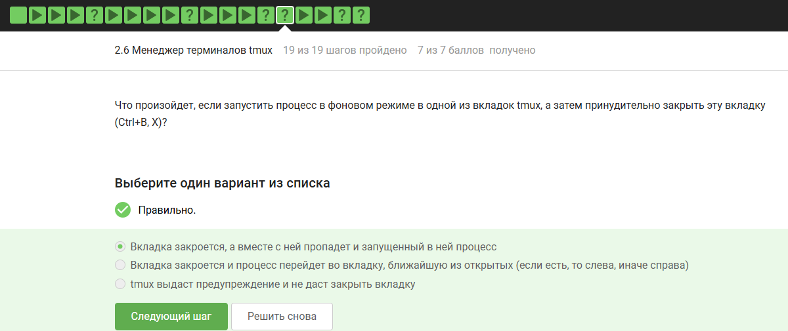
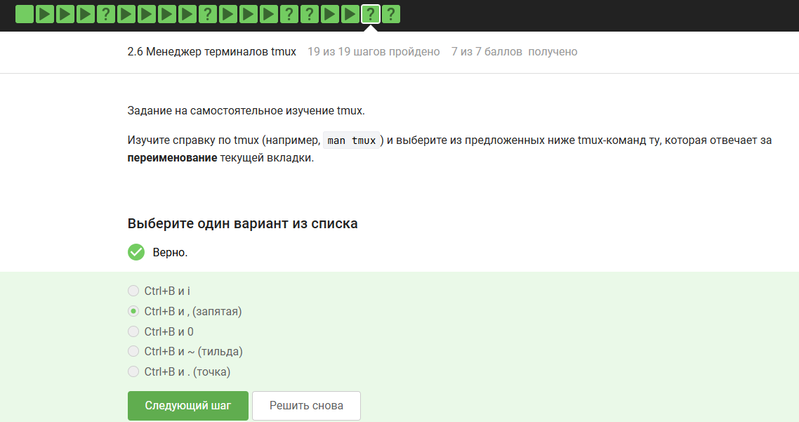
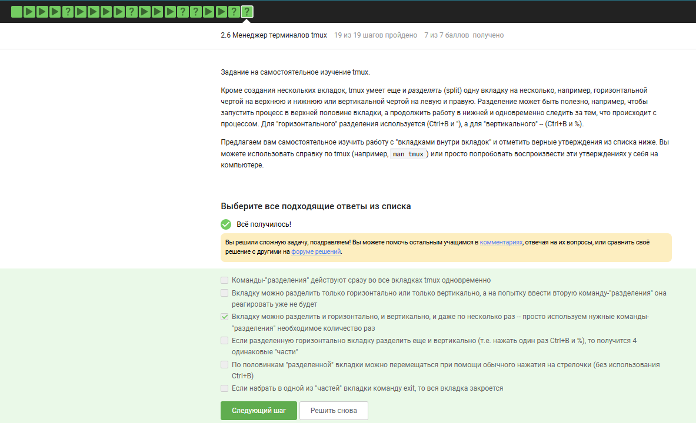

---
## Front matter
title: "Отчёт по 2 разделу внешнего курса"
subtitle: "Работа на сервере"
author: "Юсупова Амина Руслановна"

## Generic otions
lang: ru-RU
toc-title: "Содержание"

## Bibliography
bibliography: bib/cite.bib
csl: _resources/csl/gost-r-7-0-5-2008-numeric.csl

## Pdf output format
toc: true # Table of contents
toc-depth: 2
lof: true # List of figures
lot: true # List of tables
fontsize: 12pt
linestretch: 1.5
papersize: a4
documentclass: scrreprt
## I18n polyglossia
polyglossia-lang:
  name: russian
  options:
  - spelling=modern
  - babelshorthands=true
polyglossia-otherlangs:
  name: english
## I18n babel
babel-lang: russian
babel-otherlangs: english
## Fonts
mainfont: IBM Plex Serif
romanfont: IBM Plex Serif
sansfont: IBM Plex Sans
monofont: IBM Plex Mono
mathfont: STIX Two Math
mainfontoptions: Ligatures=Common,Ligatures=TeX,Scale=0.94
romanfontoptions: Ligatures=Common,Ligatures=TeX,Scale=0.94
sansfontoptions: Ligatures=Common,Ligatures=TeX,Scale=MatchLowercase,Scale=0.94
monofontoptions: Scale=MatchLowercase,Scale=0.94,FakeStretch=0.9
mathfontoptions: ''

biblatex: true
biblio-style: "gost-numeric"
biblatexoptions:
  - parentracker=true
  - backend=biber
  - hyperref=auto
  - language=auto
  - autolang=other*
  - citestyle=gost-numeric
## Pandoc-crossref LaTeX customization
figureTitle: "Рис."
tableTitle: "Таблица"
listingTitle: "Листинг"
lofTitle: "Список иллюстраций"
lotTitle: "Список таблиц"
lolTitle: "Листинги"
## Misc options
indent: true
header-includes:
  - \usepackage{indentfirst}
  - \usepackage{float} # keep figures where there are in the text
  - \floatplacement{figure}{H} # keep figures where there are in the text
---

# Цель работы

Продолжение освоения базовых практических навыков работы в консольной среде операционной системы Linux. Освоение работы с удалённым сервером, обменом файлами, управлением процессами, многопоточными приложениями и менеджером терминалов tmux.

# Выполнение заданий 

## 2.1 Знакомство с сервером

**Вопрос 1:** *Для каких задач можно использовать удаленный сервер?*  
**Правильные ответы (отмечены ✔):**  
- Хранение больших объемов данных  
- Хранение общедоступных данных (например, доступных для всех пользователей интернета)  
- Хранение конфиденциальных данных (т.е. доступ к ним должны иметь только ограниченный круг лиц)  
- Выполнение сложных (затратных по памяти и времени) вычислений  

Все предложенные варианты являются верными — удалённый сервер подходит для любого из перечисленных сценариев.

{ #fig:001 width=70% height=70% }

**Вопрос 2:** *Какой из ключей (id_rsa и id_rsa.pub) можно без опаски пересылать по интернету?*  
**Правильный ответ (отмечен ✔):** `id_rsa.pub`  

Публичный ключ (`*.pub`) предназначен для распространения, приватный ключ (`id_rsa`) необходимо хранить в секрете.

{ #fig:002 width=70% height=70% }

## 2.2 Обмен файлами

**Вопрос 1:** *Какая команда скопирует на сервер (в домашнюю директорию) папку stepic вместе с содержимым её самой и всех её подпапок?*  
**Правильный ответ (отмечен ✔):** `scp -r stepic username@server:~/`  

Ключ `-r` (recursive) обеспечивает рекурсивное копирование всей директории.

{ #fig:003 width=70% height=70% }

**Вопрос 2:** *Для чего можно использовать программу Filezilla?*  
**Правильные ответы (отмечены ✔):**  
- Для копирования файлов с сервера на свой компьютер  
- Для просмотра содержимого директорий на сервере  
- Для копирования файлов со своего компьютера на сервер  

Filezilla — это FTP/SFTP-клиент, она не предназначена для запуска или установки программ на сервере.

{ #fig:004 width=70% height=70% }

## 2.3 Запуск приложений

**Вопрос 1:** *Что можно сделать, если требуется запустить на сервере программу, для работы которой нужен не терминал, а экран?*  
**Правильные ответы (отмечены ✔):**  
- Проверить, есть ли другая версия этой программы (специально для терминала)  
- Запустить программу на своём компьютере  

Если программа требует графического интерфейса, её можно либо запустить локально, либо найти консольный аналог.

{ #fig:005 width=70% height=70% }

**Вопрос 2:** *Как обычно можно вызвать справочную информацию о программе program?*  
**Правильные ответы (отмечены ✔):**  
- `man program`  
- `program --help` (в некоторых программах бывает ещё `-help` или `-h`)  

`help program` и `program ?!` не являются стандартными способами получения справки в Linux.

{ #fig:006 width=70% height=70% }

**Вопрос 3 (FastQC):** *Как называется программа для контроля качества данных секвенирования?*  
**Правильный ответ (отмечен ✔):** `fastqc`  

Остальные варианты (`fastq`, `fasta`, `bam/sam`) — это форматы данных, а не названия программы.

{ #fig:007 width=70% height=70% }

## 2.4 Контроль запускаемых программ

**Вопрос 1:** *После выполнения действий: `fg %1`, `Ctrl+C`, `fg %2`, `Ctrl+Z`, `jobs` — информация о каких программах будет показана?*  
**Правильный ответ (отмечен ✔):** Только о `program2` и `program3`  

Разбор:  
- `program1` была завершена через `Ctrl+C` (отсутствует в `jobs`).  
- `program2` остановлена через `Ctrl+Z` (остаётся в списке как остановленная).  
- `program3` продолжала работать в фоне (остаётся в списке).

{ #fig:008 width=70% height=70% }

**Вопрос 2:** *Одинаковые ли идентификаторы процессов (PID) в jobs, top и ps?*  
**Правильный ответ (отмечен ✔):** У всех одинаковые  

PID процесса — это уникальный идентификатор, назначенный ядром системы. Все утилиты показывают один и тот же PID.

{ #fig:009 width=70% height=70% }

**Вопрос 3:** *С помощью какой команды можно мгновенно завершить остановленный процесс?*  
**Правильный ответ (отмечен ✔):** `kill -9`  

Сигнал `SIGKILL` (9) принудительно завершает процесс без возможности перехвата или игнорирования.

{ #fig:010 width=70% height=70% }

**Вопрос 4:** *Что произойдёт, если использовать `kill` (без опций) по отношению к процессу, приостановленному через `Ctrl+Z`?*  
**Правильный ответ (отмечен ✔):** Процесс будет завершён  

`kill` без опций отправляет сигнал `SIGTERM` (15), который завершает процесс (приостановленный или работающий).

{ #fig:011 width=70% height=70% }

## 2.5 Многопоточные приложения

**Вопрос 1:** *Сколько вычислительных ресурсов CPU использует остановленное (Ctrl+Z) многопоточное приложение?*  
**Правильный ответ (отмечен ✔):** 0% CPU  

Остановленный процесс не получает процессорное время.

{ #fig:012 width=70% height=70% }

**Вопрос 2:** *Сколько памяти занимает остановленное (Ctrl+Z) многопоточное приложение?*  
**Правильный ответ (отмечен ✔):** Столько, сколько оно потребляло в момент остановки  

Память не освобождается при остановке процесса, она сохраняется.

{ #fig:013 width=70% height=70% }

**Вопрос 3:** *Как принудительно завершить один из потоков запущенного многопоточного приложения?*  
**Правильный ответ (отмечен ✔):** Никак  

В стандартных средствах Linux нет возможности завершить отдельный поток процесса, не завершив весь процесс.

{ #fig:014 width=70% height=70% }

**Вопрос 4 (bowtie2):** *Какой из шагов (bowtie2-build или bowtie2) можно выполнить в несколько потоков?*  
**Правильный ответ (отмечен ✔):** Только `bowtie2`  

`bowtie2-build` (построение индекса) не поддерживает многопоточность, а `bowtie2` (выравнивание) поддерживает через ключ `-p`.

{ #fig:015 width=70% height=70% }

## 2.6 Менеджер терминалов tmux

**Вопрос 1:** *Две вкладки в терминале. В одной — приостановленный процесс, во второй — `fg`. Результат?*  
**Правильный ответ (отмечен ✔):** Терминал сообщит, что нет процесса для запуска в `fg`  

`fg` работает только в той вкладке (сессии терминала), где процесс был запущен и остановлен.

{ #fig:016 width=70% height=70% }

**Вопрос 2:** *В tmux осталась последняя открытая вкладка. Что будет при `exit`?*  
**Правильный ответ (отмечен ✔):** tmux завершит работу  

Выход из последней вкладки завершает сессию tmux.

{ #fig:017 width=70% height=70% }

**Вопрос 3:** *Зашли на сервер, запустили tmux, затем закрыли терминал. Что произойдёт?*  
**Правильный ответ (отмечен ✔):** Соединение с сервером прервётся, но работа tmux продолжится  

tmux сохраняет сессию на сервере даже при обрыве SSH-соединения.

{ #fig:018 width=70% height=70% }

**Вопрос 4:** *Процесс в фоне в одной из вкладок tmux. Принудительно закрыть вкладку (Ctrl+B, X). Что будет?*  
**Правильный ответ (отмечен ✔):** Вкладка закроется, а вместе с ней пропадёт и запущенный в ней процесс  

При закрытии вкладки tmux все процессы внутри неё завершаются.

{ #fig:019 width=70% height=70% }

**Вопрос 5:** *Какая команда в tmux отвечает за переименование текущей вкладки?*  
**Правильный ответ (отмечен ✔):** `Ctrl+B` и `,` (запятая)  

Остальные комбинации: `i` (информация), `0` (переключение), `~` (лог), `.` (изменение времени).

{ #fig:020 width=70% height=70% }

**Вопрос 6 (разделение вкладок — split):** *Верные утверждения:*  
**Правильные ответы (отмечены ✔):**  
- Вкладку можно разделить и горизонтально, и вертикально, и даже по нескольку раз — просто используем нужные команды-разделения необходимое количество раз  

Остальные утверждения неверны.

{ #fig:021 width=70% height=70% }

# Заключение

Выполнены все задания по 2 разделу курса. Освоены:
- работа с удалёнными серверами и SSH-ключами;
- копирование файлов через SCP и Filezilla;
- управление процессами (jobs, kill, фоновый/передний план);
- особенности работы многопоточных приложений;
- использование менеджера терминалов tmux (вкладки, разделение экрана, сохранение сессий).
