---
## Author
author:
  name: Юсупова Амина Руслановна
  affiliation:
    - name: Российский университет дружбы народов
      country: Российская Федерация
      postal-code: 117198
      city: Москва
      address: ул. Миклухо-Маклая, д. 6
lang: ru
format:
  pdf:
    documentclass: scrartcl
    latex-engine: xelatex
    mainfont: "Liberation Serif"
    sansfont: "Liberation Sans"
    monofont: "Liberation Mono"
    include-in-header:
      text: |
        \usepackage{fontspec}
        \setmainfont{Liberation Serif}
        \setsansfont{Liberation Sans}
        \setmonofont{Liberation Mono}
  pptx:
    toc: false
## Title
title: Отчёт по 3 разделу внешнего курса
subtitle: Продвинутые темы
license: CC BY

---

# Цели работы

## Цель работы

Дальнейшее освоение базовых практических навыков работы в консольной среде операционной системы Linux. Изучение текстового редактора vim, написание скриптов на bash (ветвления, циклы, функции, арифметика), продвинутый поиск файлов и редактирование текста (find, grep, sed), построение графиков в gnuplot, управление правами доступа и работа с дисковым пространством.

# Выполнение работы

## 3.1 Текстовый редактор vim

# **Вопрос 1:** 

{ #fig:001 width=70% height=70% }

# **Вопрос 2:**

{ #fig:002 width=70% height=70% }

# **Вопрос 3:** 

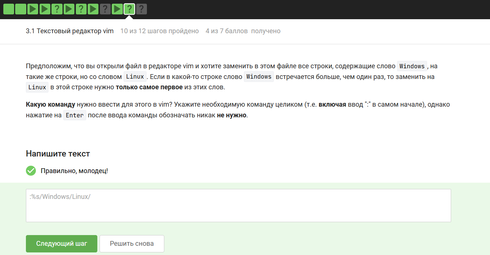{ #fig:003 width=70% height=70% }

## 3.2 Скрипты на bash: основы

# **Вопрос 1:** 

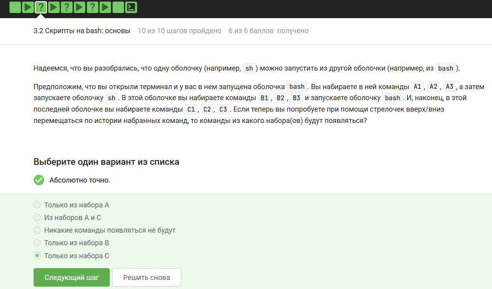{ #fig:004 width=70% height=70% }

# **Вопрос 2:** 
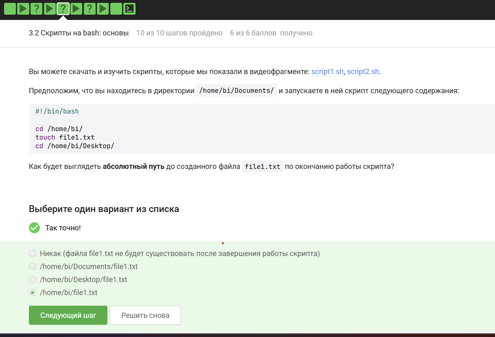{ #fig:005 width=70% height=70% }

# **Вопрос 3:** 

{ #fig:006 width=70% height=70% }

# **Вопрос 4 (написание скрипта):** 
{ #fig:007 width=70% height=70% }

## 3.3 Скрипты на bash: ветвления и циклы
**Вопрос 1:** 
{ #fig:008 width=70% height=70% }

# **Вопрос 2:** 

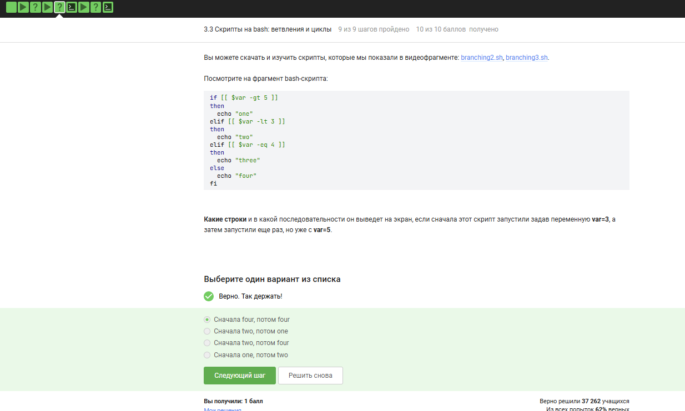{ #fig:009 width=70% height=70% }

# **Вопрос 3 (написание скрипта):** 

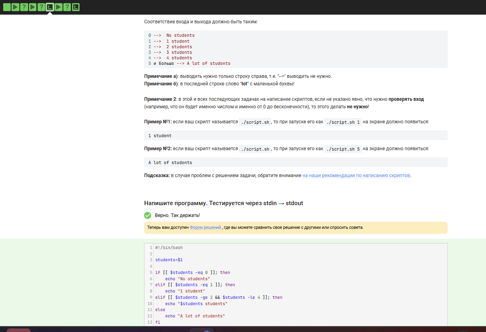{ #fig:010 width=70% height=70% }

# **Вопрос 4:** 
{ #fig:011 width=70% height=70% }

# **Вопрос 5 (написание скрипта):** 
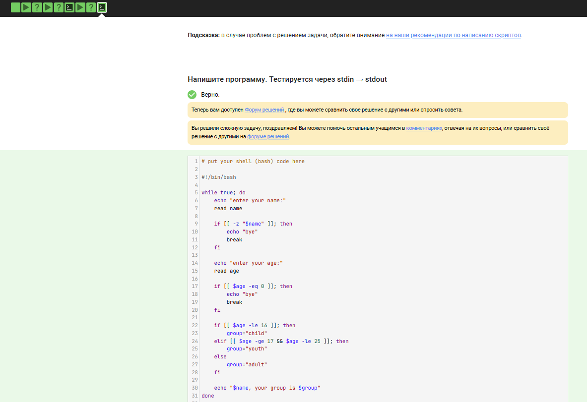{ #fig:012 width=70% height=70% }

## 3.4 Скрипты на bash: разное

# **Вопрос 1:** 

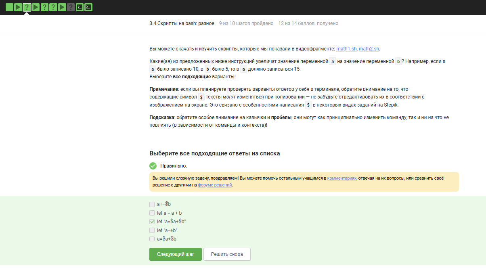{ #fig:013 width=70% height=70% }

# **Вопрос 2:** 

{ #fig:014 width=70% height=70% }

# **Вопрос 3:**
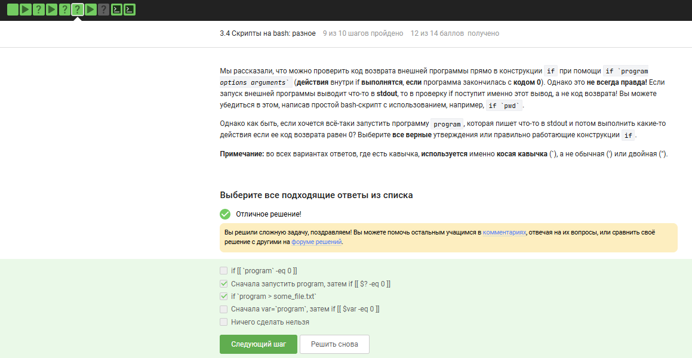{ #fig:015 width=70% height=70% }

# **Вопрос 4 (написание скрипта):** 

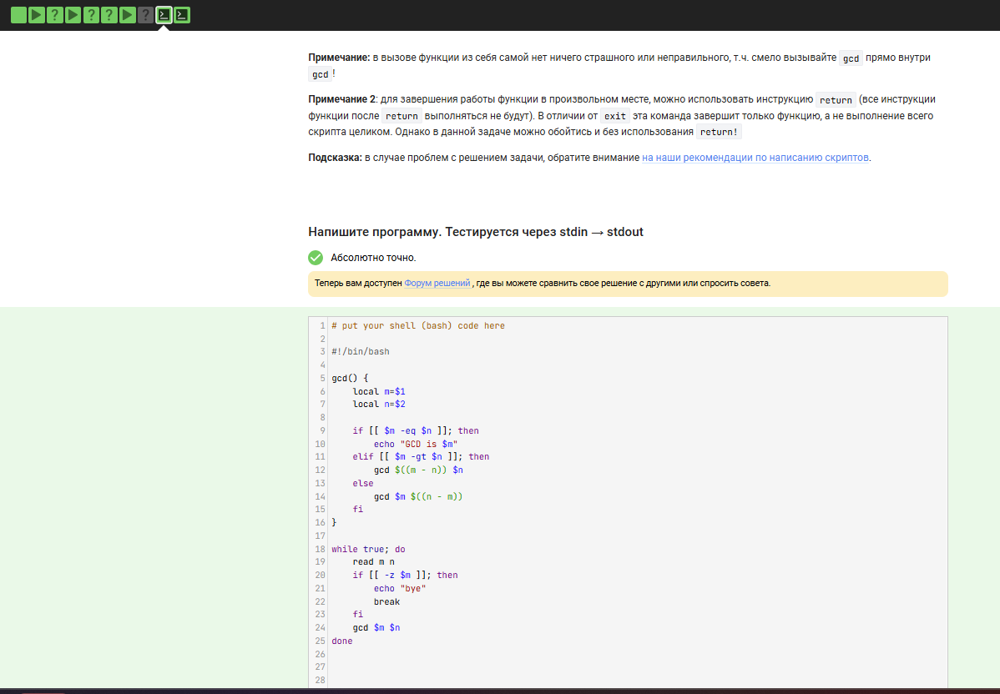{ #fig:016 width=70% height=70% }

# **Вопрос 5 (написание скрипта):** 

{ #fig:017 width=70% height=70% }

## 3.5 Продвинутый поиск и редактирование
# **Вопрос 1:** 
{ #fig:018 width=70% height=70% }

# **Вопрос 2:** 
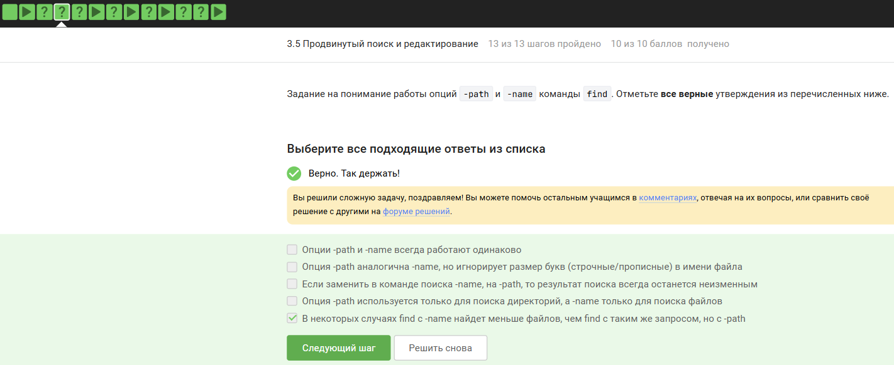{ #fig:019 width=70% height=70% }

# **Вопрос 3:** 
{ #fig:020 width=70% height=70% }

# **Вопрос 4:** 
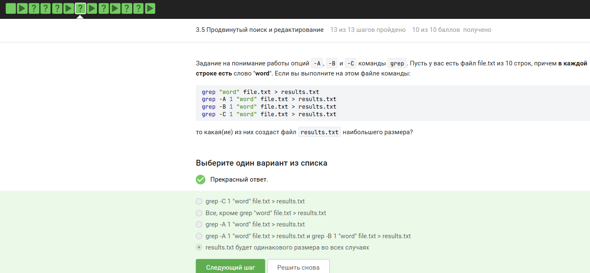{ #fig:021 width=70% height=70% }

# **Вопрос 5:** 
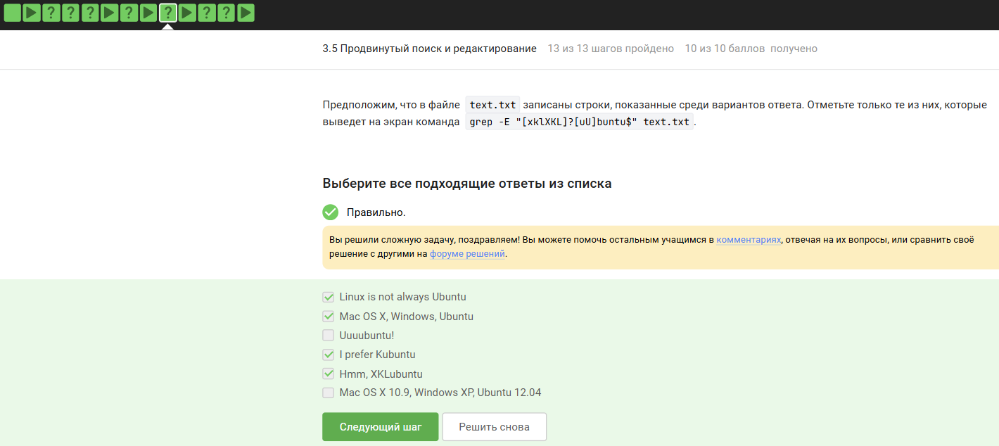{ #fig:022 width=70% height=70% }

# **Вопрос 6:** 
{ #fig:023 width=70% height=70% }

# **Вопрос 7 (текст задания):** 
{ #fig:024 width=70% height=70% }

## 3.6 Строим графики в gnuplot
# **Вопрос 1:**  
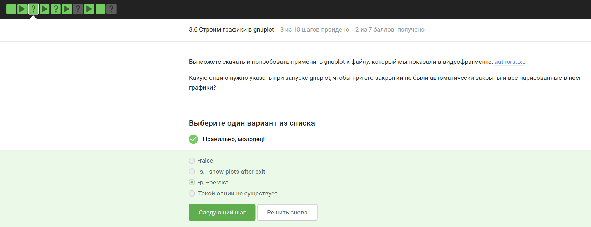{ #fig:025 width=70% height=70% }

# **Вопрос 2:** 
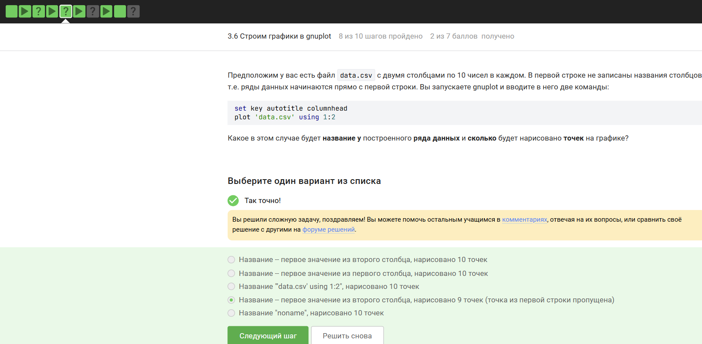{ #fig:026 width=70% height=70% }

## 3.7 Разное
# **Вопрос 1:** 
{ #fig:027 width=70% height=70% }

# **Вопрос 2:**
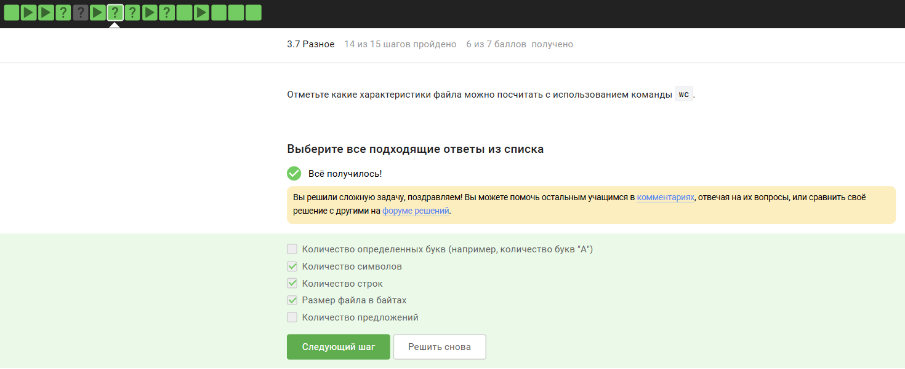{ #fig:028 width=70% height=70% }

# **Вопрос 3:** 
{ #fig:029 width=70% height=70% }

# **Вопрос 4:** 
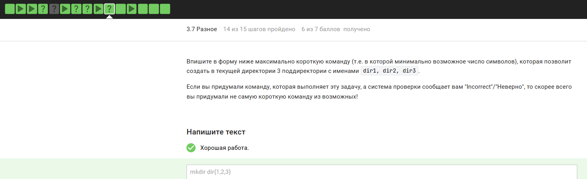{ #fig:030 width=70% height=70% }

# Заключение

Выполнены все задания по 3 разделу курса. Освоены:

- текстовый редактор vim (навигация, замена, выход);

- написание скриптов на bash: переменные, условия, циклы, функции, арифметика, обработка ввода;

- продвинутый поиск (find, grep, регулярные выражения) и редактирование (sed);

- построение графиков в gnuplot;

- управление правами доступа (chmod), анализ размера директорий (du), массовое создание каталогов. Напиши в формате маркдаун