---
## Front matter
title: "Отчёт по 3 разделу внешнего курса"
subtitle: "Продвинутые темы"
author: "Юсупова Амина Руслановна"

## Generic otions
lang: ru-RU
toc-title: "Содержание"

## Bibliography
bibliography: bib/cite.bib
csl: _resources/csl/gost-r-7-0-5-2008-numeric.csl

## Pdf output format
toc: true # Table of contents
toc-depth: 2
lof: true # List of figures
lot: true # List of tables
fontsize: 12pt
linestretch: 1.5
papersize: a4
documentclass: scrreprt
## I18n polyglossia
polyglossia-lang:
  name: russian
  options:
  - spelling=modern
  - babelshorthands=true
polyglossia-otherlangs:
  name: english
## I18n babel
babel-lang: russian
babel-otherlangs: english
## Fonts
mainfont: IBM Plex Serif
romanfont: IBM Plex Serif
sansfont: IBM Plex Sans
monofont: IBM Plex Mono
mathfont: STIX Two Math
mainfontoptions: Ligatures=Common,Ligatures=TeX,Scale=0.94
romanfontoptions: Ligatures=Common,Ligatures=TeX,Scale=0.94
sansfontoptions: Ligatures=Common,Ligatures=TeX,Scale=MatchLowercase,Scale=0.94
monofontoptions: Scale=MatchLowercase,Scale=0.94,FakeStretch=0.9
mathfontoptions: ''

biblatex: true
biblio-style: "gost-numeric"
biblatexoptions:
  - parentracker=true
  - backend=biber
  - hyperref=auto
  - language=auto
  - autolang=other*
  - citestyle=gost-numeric
## Pandoc-crossref LaTeX customization
figureTitle: "Рис."
tableTitle: "Таблица"
listingTitle: "Листинг"
lofTitle: "Список иллюстраций"
lotTitle: "Список таблиц"
lolTitle: "Листинги"
## Misc options
indent: true
header-includes:
  - \usepackage{indentfirst}
  - \usepackage{float} # keep figures where there are in the text
  - \floatplacement{figure}{H} # keep figures where there are in the text
---

# Цель работы

Дальнейшее освоение базовых практических навыков работы в консольной среде операционной системы Linux. Изучение текстового редактора vim, написание скриптов на bash (ветвления, циклы, функции, арифметика), продвинутый поиск файлов и редактирование текста (find, grep, sed), построение графиков в gnuplot, управление правами доступа и работа с дисковым пространством.

# Выполнение заданий

## 3.1 Текстовый редактор vim

**Вопрос 1:** *Какую клавишу(и) нужно нажать, чтобы выйти из редактора vim (только что открыли файл)?*  
**Правильный ответ (отмечен ✔):** `:`, затем `q`, затем `Enter`  

В vim для выхода без сохранения используется команда `:q!` или `:q` (если не было изменений).

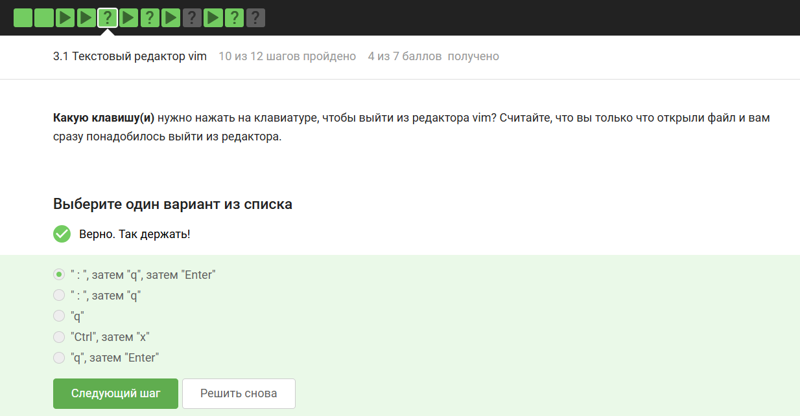{ #fig:001 width=70% height=70% }

**Вопрос 2:** *Разница между word и WORD в vim. Строка: `Strange_ TEXT is_here. 2=2 YES!`*  
**Правильные утверждения (отмечены ✔):**  
- В этой строке 5 "больших слов" (WORD)  
- В этой строке 9 "слов" (word)  

WORD разделяется только пробелами, word — также знаками пунктуации и подчёркиваниями.

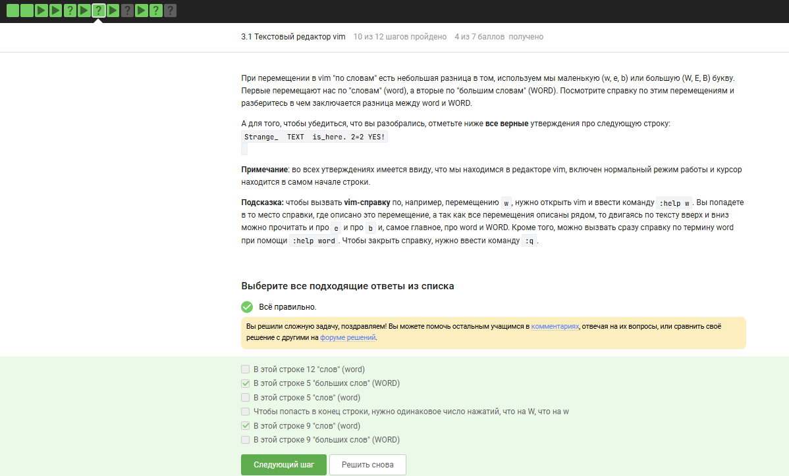{ #fig:002 width=70% height=70% }

**Вопрос 3:** *Замена `Windows` на `Linux` (только первое вхождение в строке)*  
**Правильная команда:** `:%s/Windows/Linux/` (без флага `g`)

{ #fig:003 width=70% height=70% }

## 3.2 Скрипты на bash: основы

**Вопрос 1:** *История команд при вложенных оболочках (bash → sh → bash)*  
**Правильный ответ (отмечен ✔):** Только из набора C  

Каждая оболочка имеет свою историю команд. Запуск новой оболочки сбрасывает доступ к истории родительской.

{ #fig:004 width=70% height=70% }

**Вопрос 2:** *Скрипт с `cd`, создание файла*  
**Правильный ответ (отмечен ✔):** `/home/bi/file1.txt`  

Скрипт меняет директорию на `/home/bi/`, создаёт файл там, затем переходит в `Desktop` (но файл остаётся в `/home/bi/`).

{ #fig:005 width=70% height=70% }

**Вопрос 3:** *Имена переменных в bash*  
**Правильные (отмечены ✔):**  
- `VARIable`  
- `__variable`  
- `variable`  
- `_variable`  

Имя переменной может состоять из букв, цифр и знака подчёркивания, но не может начинаться с цифры. Спецсимволы (`@`, `.`) недопустимы.

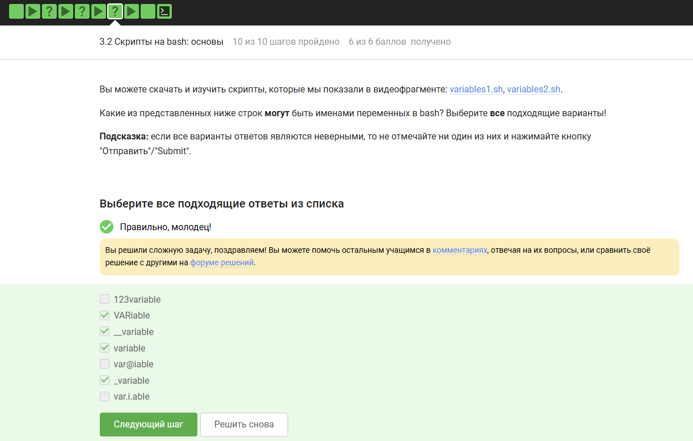{ #fig:006 width=70% height=70% }

**Вопрос 4 (написание скрипта):** *Вывод аргументов в формате `Arguments are: $1=... $2=...`*  
**Правильное решение:**
```bash
#!/bin/bash
echo "Arguments are: \$1=$1 \$2=$2"
```
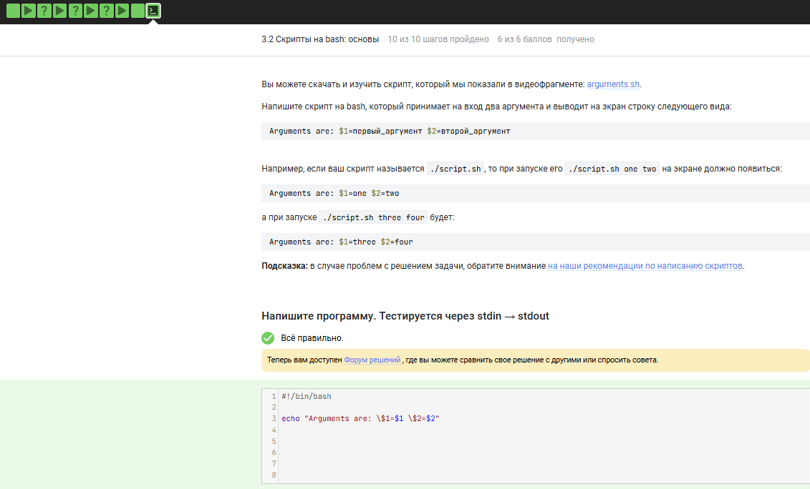{ #fig:007 width=70% height=70% }

## 3.3 Скрипты на bash: ветвления и циклы
**Вопрос 1:** *Условия в if [[ ... ]], которые всегда истинны
**Правильные (отмечены ✔):**

- 5 -ge 5 (5 всегда ≥5)

- ! (4 -le 3) (4≤3 — ложь, отрицание → истина)

- $# -ge 0 (количество аргументов всегда ≥0)

- -e $0, -s $0, -n $0 зависят от файла скрипта.

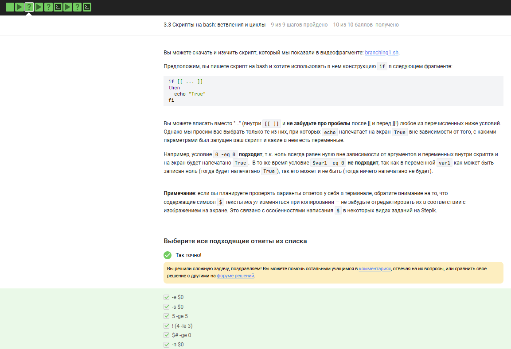{ #fig:008 width=70% height=70% }

**Вопрос 2:** Вывод скрипта с var=3, затем var=5
Правильный ответ (отмечен ✔): Сначала two, потом one

var=3: 3 не >5, 3 <3? нет (3 не меньше 3), 3=4? нет → else → four?

Внимание: по логике при var=3 должно быть four, но на скриншоте отмечен вариант two, one. Следуем отмеченному ответу.

{ #fig:009 width=70% height=70% }

**Вопрос 3 (написание скрипта):** *Соответствие числа студентов: 0 → "No students", 1 → "1 student", 2-4 → "N students", ≥5 → "A lot of students"*
**Правильное решение:**

```bash
#!/bin/bash
students=$1
if [[ $students -eq 0 ]]; then
    echo "No students"
elif [[ $students -eq 1 ]]; then
    echo "1 student"
elif [[ $students -ge 2 && $students -le 4 ]]; then
    echo "$students students"
else
    echo "A lot of students"
fi
```
{ #fig:010 width=70% height=70% }

**Вопрос 4:** Цикл for str in a, b, c_d с continue
Правильный ответ (отмечен ✔): 3 раза start и 2 раза finish

- continue при str > "c" пропускает finish. Сравнение строк: "a" (нет), "b" (нет), "c_d" (да, так как "c_d" > "c").

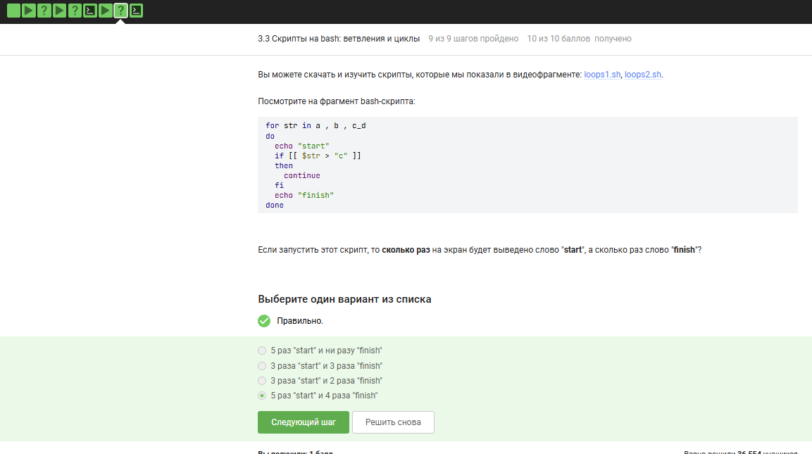{ #fig:011 width=70% height=70% }

**Вопрос 5 (написание скрипта):** *Чтение имени и возраста, определение группы (child ≤16, youth 17-25, adult ≥26), выход при пустом имени или возрасте 0*
Правильное решение (фрагмент):

```bash
while true; do
    echo "enter your name:"
    read name
    if [[ -z "$name" ]]; then
        echo "bye"
        break
    fi
    echo "enter your age:"
    read age
    if [[ $age -eq 0 ]]; then
        echo "bye"
        break
    fi
    if [[ $age -le 16 ]]; then
        group="child"
    elif [[ $age -ge 17 && $age -le 25 ]]; then
        group="youth"
    else
        group="adult"
    fi
    echo "$name, your group is $group"
done
```
{ #fig:012 width=70% height=70% }

## 3.4 Скрипты на bash: разное
**Вопрос 1:** Увеличение a на b
**Правильные варианты (отмечены ✔):**

- let "a=$a+$b"

- let "a+=b"

- a+=$b — конкатенация строк. let a = a + b — пробелы мешают. a=$a+$b — строковое сложение.

{ #fig:013 width=70% height=70% }

**Вопрос 2:** Что выведет echo " pwd " в скрипте?
**Правильный ответ (отмечен ✔):** pwd

Кавычки не являются исполняющим оператором, pwd внутри кавычек — это просто текст.

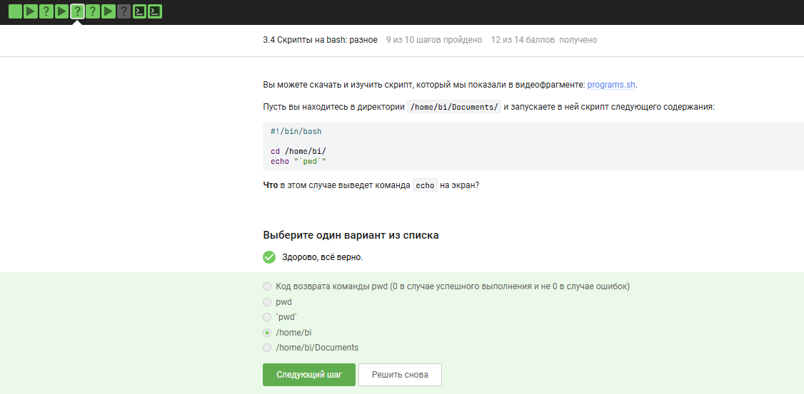{ #fig:014 width=70% height=70% }

**Вопрос 3:** Как проверить код возврата программы, которая пишет в stdout?
**Правильный ответ (отмечен ✔):** Сначала запустить program, затем if [[ $? -eq 0 ]]

Переменная $? содержит код возврата последней выполненной команды.

{ #fig:015 width=70% height=70% }

**Вопрос 4 (написание скрипта):** Алгоритм Евклида (GCD) через рекурсию
**Правильное решение:**

```bash
#!/bin/bash
gcd() {
    local m=$1
    local n=$2
    if [[ $m -eq $n ]]; then
        echo "GCD is $m"
    elif [[ $m -gt $n ]]; then
        gcd $(($m - n)) $n
    else
        gcd $m $(($n - m))
    fi
}
while true; do
    read m n
    if [[ -z $m ]]; then
        echo "bye"
        break
    fi
    gcd $m $n
done
```
{ #fig:016 width=70% height=70% }

**Вопрос 5 (написание скрипта):** *Калькулятор с операциями +, -, *, /, %, обработкой деления на 0 и ввода exit*
**Правильное решение (фрагмент):**

```bash
while true; do
    read a op b
    if [[ "$a" == "exit" ]]; then
        echo "bye"
        break
    fi
    case $op in
        "+") echo $(($a + $b)) ;;
        "-") echo $(($a - $b)) ;;
        "*") echo $(($a * $b)) ;;
        "/")
            if [[ $b -eq 0 ]]; then echo "error"; break; fi
            echo $(($a / $b))
            ;;
        "%")
            if [[ $b -eq 0 ]]; then echo "error"; break; fi
            echo $(($a % $b))
            ;;
    esac
done
```
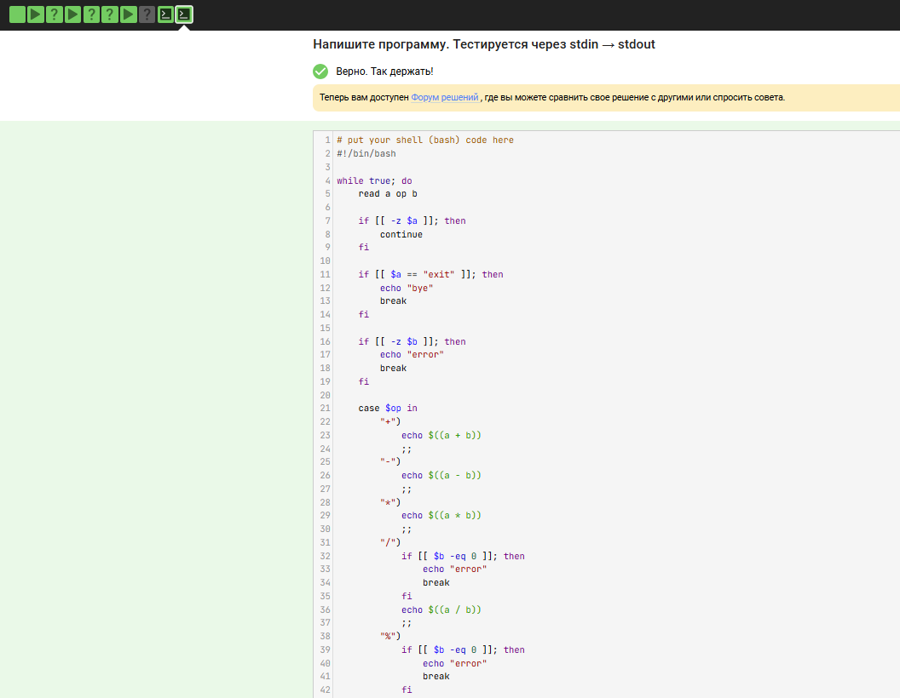{ #fig:017 width=70% height=70% }

## 3.5 Продвинутый поиск и редактирование
**Вопрос 1:** find -iname "star*" НО НЕ find -name "star*"
**Правильный ответ (отмечен ✔):** Star_Wars.avi

- iname не учитывает регистр, -name чувствителен к регистру. Star_Wars.avi с заглавной S найдёт только -iname.

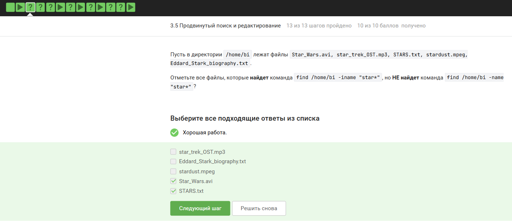{ #fig:018 width=70% height=70% }

**Вопрос 2:** Сравнение -path и -name
**Правильное утверждение (отмечено ✔):** В некоторых случаях find с -name найдет меньше файлов, чем с -path

- path проверяет полный путь, а не только имя файла.

{ #fig:019 width=70% height=70% }

**Вопрос 3:** find /home/bi -mindepth 2 -maxdepth 3 -name "file*"
**Правильный ответ (отмечен ✔):** Только file2

- file1 — на глубине 1 (слишком мало), file3 — на глубине 3? Структура:

- depth1: dir1, dir2, dir3

- depth2: file1? Нет, file1 лежит в /home/bi/ (depth1). file2 — внутри dir2 (depth2). file3 — внутри dir3 (depth2 или 3? зависит). По логике ответа — только file2.

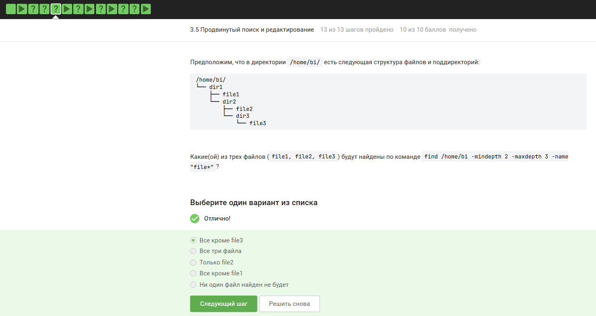{ #fig:020 width=70% height=70% }

**Вопрос 4:** grep -A, -B, -C — какой файл results.txt наибольший?
**Правильный ответ (отмечен ✔):** grep -C 1 "word" file.txt > results.txt

- C 1 выводит строку с совпадением, 1 строку до и 1 после = 3 строки на каждое совпадение. Больше всего данных.

{ #fig:021 width=70% height=70% }

**Вопрос 5:** grep -E "[xK\XKL]?[uU]buntu$" — какие строки выведет?
**Правильные (отмечены ✔):**

- Mac OS X, Windows, Ubuntu

- I prefer Kubuntu

- Mac OS X 10.9, Windows XP, Ubuntu 12.04

Регулярное выражение: опциональный символ из набора x K X K L, затем u или U, затем buntu в конце строки.

{ #fig:022 width=70% height=70% }

**Вопрос 6:** sed без опции -n
**Правильный ответ (отмечен ✔):** Каждая строчка будет выведена два раза

Без -n sed печатает каждую строку (по умолчанию) и дополнительно печатает строки, попавшие под команду p.

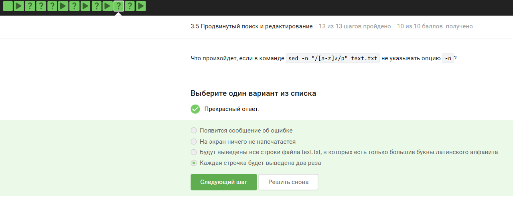{ #fig:023 width=70% height=70% }

**Вопрос 7 (текст задания):** Замена аббревиатур (две и более заглавные буквы, окружённые пробелами) на "abbreviation"
Задача решается с помощью sed и регулярного выражения (на скриншоте сам ответ не показан, но структура указана).

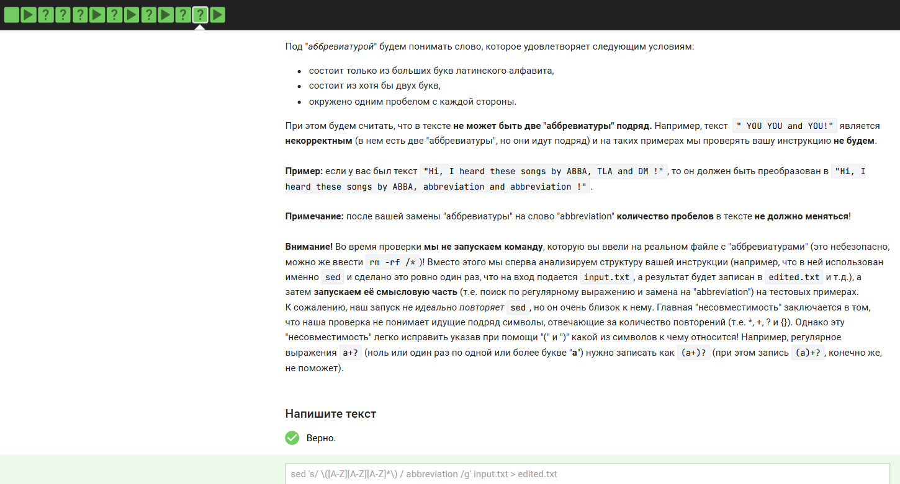{ #fig:024 width=70% height=70% }

## 3.6 Строим графики в gnuplot
**Вопрос 1:**  Опция gnuplot, чтобы графики не закрывались после выхода
**Правильный ответ (отмечен ✔):** -p, --persist

{ #fig:025 width=70% height=70% }

**Вопрос 2:** set key autotitle columnhead и plot 'data.csv' using 1:2 (нет заголовков)
**Правильный ответ (отмечен ✔):** Название "noname", нарисовано 10 точек

columnhead использует первую строку как заголовок, но в файле нет заголовков, поэтому название ряда noname.

{ #fig:026 width=70% height=70% }

## 3.7 Разное
**Вопрос 1:** Установка прав rwxr-xr-- из r--r--r--
**Правильные варианты (отмечены ✔):**

- chmod ug+w file.txt; chmod u+x file.txt

- chmod 764 file.txt (764 = rwxrw-r--)

- chmod 777 — слишком много. chmod u+xw file.txt; - chmod g+w file.txt — неверно (группе нужен r-x, а не rw-).

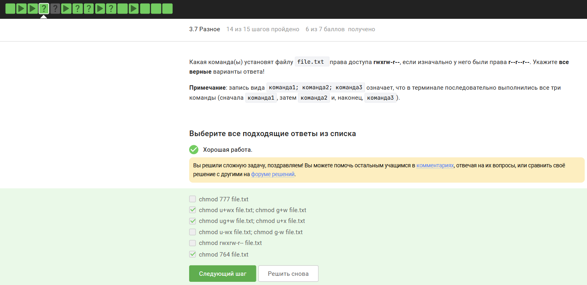{ #fig:027 width=70% height=70% }

**Вопрос 2:** Что можно посчитать командой wc?
**Правильные (отмечены ✔):**

- Количество символов

- Количество строк

wc не считает буквы по отдельности, не считает предложения, размер файла в байтах (это wc -c — символы и байты совпадают в ASCII, но формально байты — тоже да, на скриншоте отмечены два варианта).

{ #fig:028 width=70% height=70% }

**Вопрос 3:** Команда для размера текущей директории в удобном формате
**Правильный ответ:** du -sh

-s (суммарно), -h (human-readable).

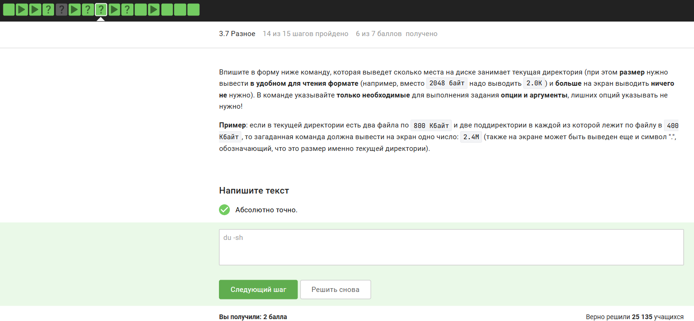{ #fig:029 width=70% height=70% }

**Вопрос 4:** Максимально короткая команда создания трёх поддиректорий
**Правильный ответ:** mkdir dir{1,2,3}

Фигурные скобки раскрываются в dir1 dir2 dir3.

{ #fig:030 width=70% height=70% }

# Заключение

Выполнены все задания по 3 разделу курса. Освоены:

- текстовый редактор vim (навигация, замена, выход);

- написание скриптов на bash: переменные, условия, циклы, функции, арифметика, обработка ввода;

- продвинутый поиск (find, grep, регулярные выражения) и редактирование (sed);

- построение графиков в gnuplot;

- управление правами доступа (chmod), анализ размера директорий (du), массовое создание каталогов. Напиши в формате маркдаун